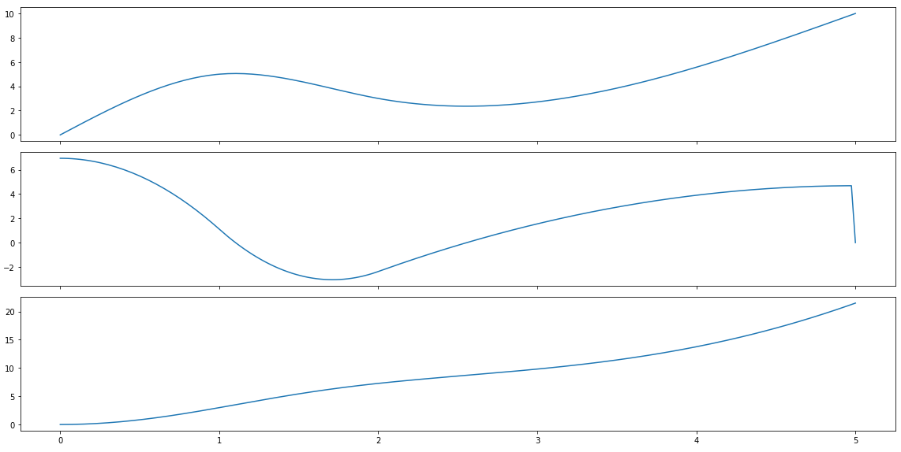
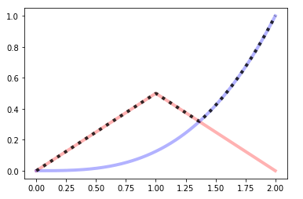
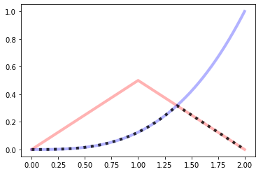
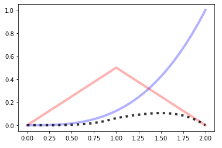
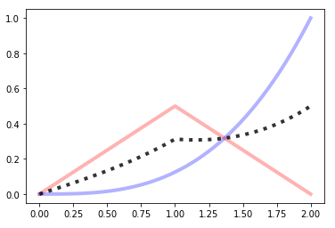
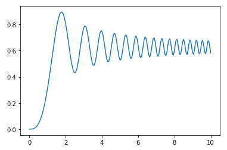
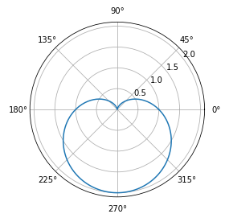
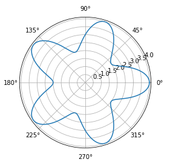

BPF4
====


About
-----

**bpf4** is a python library to operate with curves in 2D space. 

Curves can be defined via breakpoints (break-point functions, hence the name) or using functions.
Moreover, curves can be used to build other curves. **bpf4** can be used to perform
curve fitting, data analysis, plotting, etc. Its core is programmed
in cython for efficiency.


Installation
------------


```bash
pip install --upgrade bpf4

```

Documentation
-------------

The documentation is hosted at https://bpf4.readthedocs.io


-----------------

Example
-------

Find the intersection between two curves

```python

from bpf4 import bpf  # this imports the api
a = bpf.spline((0, 0), (1, 5), (2, 3), (5, 10))  # each point (x, y)
b = bpf.expon((0, -10), (2,15), (5, 3), exp=3)
a.plot() # uses matplotlib
b.plot() 
zeros = (a - b).zeros()
import pylab
pylab.plot(zeros, a.map(zeros), 'o')
```
   


Features
--------

Many interpolation types besides linear:

* spline
* univariate splie
* pchip (hermite)
* cosine
* exponential
* logarithmic
* etc. 


With the exception of curve-fitting bpfs (splines), interpolation types can be mixed, so that each segment 
has a different interpolation. Following from the example above:  


```pyton

c = (a + b).sin().abs()
# plot only the range (1.5, 4)
c[1.5:4].plot()  

```


Syntax support for shifting, scaling and slicing a bpf

```python

a >> 2        # a shifted to the right
(a * 5) ^ 2   # scale the x coord by 2, scale the y coord by 5
a[2:2.5]      # slice only a portion of the bpf
a[::0.01]     # sample the bpf with an interval of 0.01

```

### Derivation / Integration

```python
from bpf4 import *
a = spline((0, 0), (1, 5), (2, 3), (5, 10))
deriv = a.derivative()
integr = a.integrated()

import matplotlib.pyplot as plt 
fig, axs = plt.subplots(3, 1, sharex=True, figsize=(16, 8), tight_layout=True)
a.plot(axes=axs[0], show=False)
deriv.plot(axes=axs[1], show=False)
integr.plot(axes=axs[2])
```




----------------

## Mathematical operations

### Max / Min

```python
a = linear(0, 0, 1, 0.5, 2, 0)
b = expon(0, 0, 2, 1, exp=3)
a.plot(show=False, color="red", linewidth=4, alpha=0.3)
b.plot(show=False, color="blue", linewidth=4, alpha=0.3)
core.Max((a, b)).plot(color="black", linewidth=4, alpha=0.8, linestyle='dotted')
```


```python
a = linear(0, 0, 1, 0.5, 2, 0)
b = expon(0, 0, 2, 1, exp=3)
a.plot(show=False, color="red", linewidth=4, alpha=0.3)
b.plot(show=False, color="blue", linewidth=4, alpha=0.3)
core.Min((a, b)).plot(color="black", linewidth=4, alpha=0.8, linestyle='dotted')
```



### `+, -, *, /`

```
a = linear(0, 0, 1, 0.5, 2, 0)
b = expon(0, 0, 2, 1, exp=3)
a.plot(show=False, color="red", linewidth=4, alpha=0.3)
b.plot(show=False, color="blue", linewidth=4, alpha=0.3)
(a*b).plot(color="black", linewidth=4, alpha=0.8, linestyle='dotted')
```


```python
a = linear(0, 0, 1, 0.5, 2, 0)
b = expon(0, 0, 2, 1, exp=3)
a.plot(show=False, color="red", linewidth=4, alpha=0.3)
b.plot(show=False, color="blue", linewidth=4, alpha=0.3)
(a**b).plot(color="black", linewidth=4, alpha=0.8, linestyle='dotted')
```


```python
a = linear(0, 0, 1, 0.5, 2, 0)
b = expon(0, 0, 2, 1, exp=3)
a.plot(show=False, color="red", linewidth=4, alpha=0.3)
b.plot(show=False, color="blue", linewidth=4, alpha=0.3)
((a+b)/2).plot(color="black", linewidth=4, alpha=0.8, linestyle='dotted')
```


### Building functions

A bpf can be used to build complex formulas

**Fresnel's Integral**: \( S(x) = \int_0^x {sin(t^2)} dt \)

```python
t = slope(1)
f = (t**2).sin()[0:10:0.001].integrated()
f.plot()
```




#### Polar plots

Any kind of matplotlib plot can be used. For example, polar plots are possible
by creating an axes with *polar*=`True`

**Cardiod**: \(\rho = 1 + sin(-\theta) \)

```python

from math import *
theta = slope(1, bounds=(0, 2*pi))
r = 1 + (-theta).sin()

ax = plt.axes(polar=True)
ax.set_rticks([0.5, 1, 1.5, 2]); ax.set_rlabel_position(38)
r.plot(axes=ax)
```



**Flower 5**: \(\rho = 3 + cos(5 * \theta) \)

```python
theta = core.Slope(1, bounds=(0, 2*pi))
r = 3 + (5*theta).cos()

ax = plt.axes(polar=True)
r.plot(axes=ax)

```

