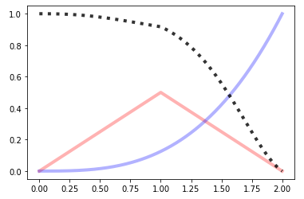

BPF4
====


About
-----

bpf4 is a library for curve fitting and break-point functions in python. It is mainly programmed in Cython for efficiency. 


Documentation
-------------

The documentation is hosted at https://bpf4.readthedocs.io


-----------------

Example
-------

Find the intersection between two curves

```python

from bpf4 import bpf  # this imports the api
a = bpf.spline((0, 0), (1, 5), (2, 3), (5, 10))  # each point (x, y)
b = bpf.expon((0, -10), (2,15), (5, 3), exp=3)
a.plot() # uses matplotlib
b.plot() 
zeros = (a - b).zeros()
import pylab
pylab.plot(zeros, a.map(zeros), 'o')
```
   


Features
--------

Many interpolation types besides linear:

* spline
* half-cosine
* exponential
* fibonacci
* exponantial half-cosine
* pchip
* logarithmic
* etc. 

Interpolation types can be mixed, so that each segment has a different interpolation (with the exception of spline interpolation)  
Curves can be combined non-destructively. Following from the example above.  

```pyton

c = (a + b).sin().abs()
c[1.5:4].plot()  # plot only the range (1.5, 4)

```


Syntax support for shifting, scaling and slicing a bpf

```python

a >> 2        # a shifted to the right
(a * 5) ^ 2   # scale the x coord by 2, scale the y coord by 5
a[2:2.5]      # slice only a portion of the bpf
a[::0.01]     # sample the bpf with an interval of 0.01

```

* Derivation and Integration: `c.derivative().plot()` or `c.integrated().integrated().plot()`  
* Numerical integration: `c.integrate_between(2, 4)`  


Installation
------------


```bash
pip install --upgrade bpf4

```


To install from source:


```bash

git clone https://github.com/gesellkammer/bpf4.git
cd bpf4
pip install .
```

----------------

## Mathematical operations

### Max / Min

```python
a = linear(0, 0, 1, 0.5, 2, 0)
b = expon(0, 0, 2, 1, exp=3)
a.plot(show=False, color="red", linewidth=4, alpha=0.3)
b.plot(show=False, color="blue", linewidth=4, alpha=0.3)
core.Max((a, b)).plot(color="black", linewidth=4, alpha=0.8, linestyle='dotted')
```


```python
a = linear(0, 0, 1, 0.5, 2, 0)
b = expon(0, 0, 2, 1, exp=3)
a.plot(show=False, color="red", linewidth=4, alpha=0.3)
b.plot(show=False, color="blue", linewidth=4, alpha=0.3)
core.Min((a, b)).plot(color="black", linewidth=4, alpha=0.8, linestyle='dotted')
```


### `+, -, *, /`

```
a = linear(0, 0, 1, 0.5, 2, 0)
b = expon(0, 0, 2, 1, exp=3)
a.plot(show=False, color="red", linewidth=4, alpha=0.3)
b.plot(show=False, color="blue", linewidth=4, alpha=0.3)
(a*b).plot(color="black", linewidth=4, alpha=0.8, linestyle='dotted')
```


```python
a = linear(0, 0, 1, 0.5, 2, 0)
b = expon(0, 0, 2, 1, exp=3)
a.plot(show=False, color="red", linewidth=4, alpha=0.3)
b.plot(show=False, color="blue", linewidth=4, alpha=0.3)
(a**b).plot(color="black", linewidth=4, alpha=0.8, linestyle='dotted')
```


```python
a = linear(0, 0, 1, 0.5, 2, 0)
b = expon(0, 0, 2, 1, exp=3)
a.plot(show=False, color="red", linewidth=4, alpha=0.3)
b.plot(show=False, color="blue", linewidth=4, alpha=0.3)
((a+b)/2).plot(color="black", linewidth=4, alpha=0.8, linestyle='dotted')
```


### Building functions

A bpf can be used to build complex formulas

**Fresnel's Integral**: \( S(x) = \int_0^x {sin(t^2)} dt \)

```python
t = slope(1)
f = (t**2).sin()[0:10:0.001].integrated()
f.plot()
```


#### Polar plots

Any kind of matplotlib plot can be used. For example, polar plots are possible
by creating an axes with *polar*=`True`

**Cardiod**: \(\rho = 1 + sin(-\theta) \)

```python

from math import *
theta = slope(1, bounds=(0, 2*pi))
r = 1 + (-theta).sin()

ax = plt.axes(polar=True)
ax.set_rticks([0.5, 1, 1.5, 2]); ax.set_rlabel_position(38)
r.plot(axes=ax)
```


**Flower 5**: \(\rho = 3 + cos(5 * \theta) \)

```python
theta = core.Slope(1, bounds=(0, 2*pi))
r = 3 + (5*theta).cos()

ax = plt.axes(polar=True)
r.plot(axes=ax)

```
