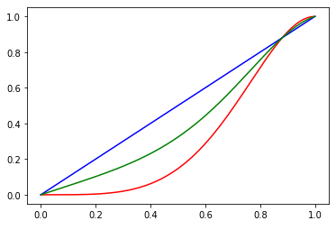
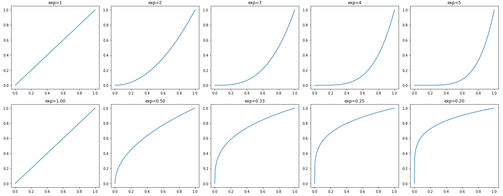
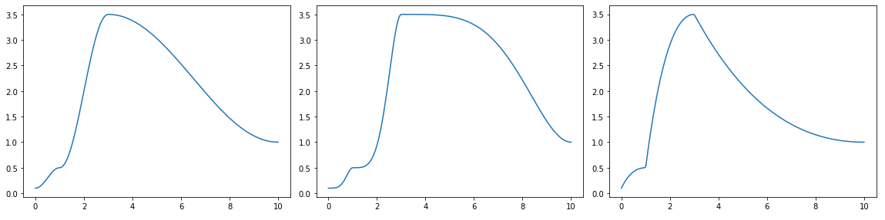
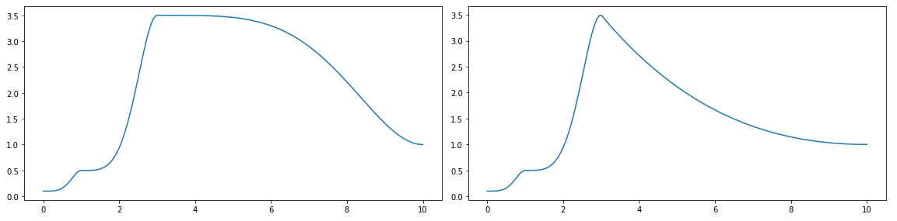
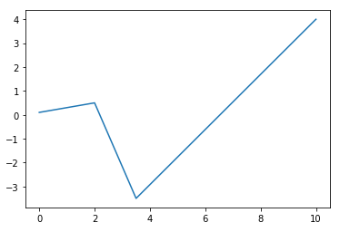
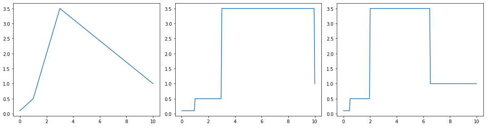
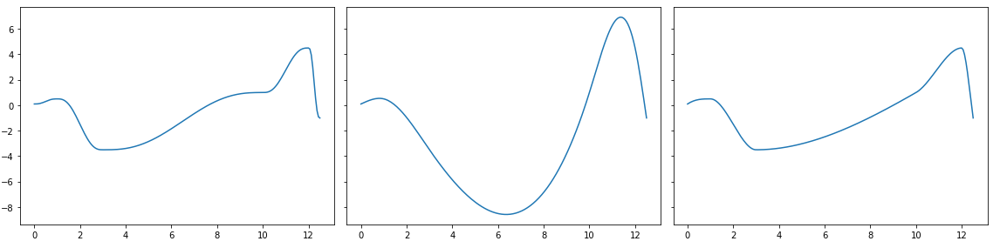
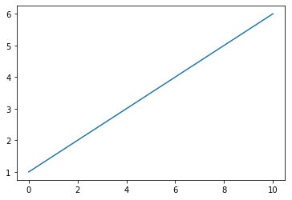
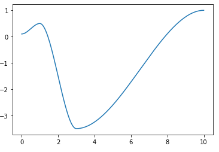
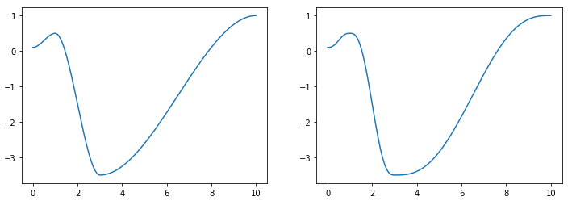

# api


## High-level API for bpf4

The API allows a high-level and flexible interface to the core of bpf4,
which is implemented in cython for efficiency. 

### API vs core

These three curves, *a*, *b* and *c* define the same linear break-point-function
The first two definitions, *a* and *b*, use the high-level API, which allows for
points to be defined as a flat sequence, as tuples of (x, y). The *core* classes
need to be instantiated with two arrays of *x* and *y* values, as in *c*

```python

from bpf4 import *
a = linear(0, 0, 1, 2.5, 3, 10)
b = linear((0, 0), (1, 2.5), (3, 10))
c = core.Linear([0, 1, 3], [0, 2.5, 10])
```


---------


| Function  | Description  |
| :-------  | :----------- |
| `blendshape` | Create a bpf blending two interpolation forms |
| `const` | A bpf which always returns a constant value |
| `expon` | Construct an Expon bpf (a bpf with exponential interpolation) |
| `halfcos` | Construct a half-cosine bpf (a bpf with half-cosine interpolation) |
| `halfcosexp` | Construct a half-cosine bpf (a bpf with half-cosine interpolation) |
| `halfcosm` | Halfcos interpolation with symmetric exponent |
| `linear` | Construct a Linear bpf. |
| `multi` | A bpf with a per-pair interpolation |
| `nearest` | A bpf with floor interpolation |
| `nointerpol` | A bpf with floor interpolation |
| `pchip` | Monotonic Cubic Hermite Intepolation |
| `slope` | Generate a straight line with the given slope and offset |
| `smooth` | A bpf with smoothstep interpolation. |
| `smoother` | A bpf with smootherstep interpolation |
| `spline` | Construct a cubic-spline bpf |
| `stack` | A bpf representing a stack of bpf |
| `uspline` | Construct a univariate cubic-spline bpf |


---------


## blendshape


```python

def blendshape(shape0: str, shape1: str, mix: float | core.BpfInterface, points
               ) -> core.BpfInterface

```


Create a bpf blending two interpolation forms


### Example

```python

from bpf4 import *
a = blendshape('halfcos(2.0)', 'linear', mix=0.5, points=(0, 0, 1, 1))
halfcos(0, 0, 1, 1, exp=2).plot(color='red')
linear(0, 0, 1, 1).plot(color='blue')
a.plot(color='green')
```



**Args**

* **shape0** (`str`): a description of the first interpolation
* **shape1** (`str`): a description of the second interpolation
* **mix** (`float | core.BpfInterface`): blend factor.         A value between 0
    (use only `shape0`)         and 1 (use only `shape1`). A value of `0.5` will
    result in         an average between the first and second interpolation
    kind.         Can be a bpf itself, returning the mix value at any x value
* **points**: either a tuple `(x0, y0, x1, y1, ...)` or a tuple `(xs, ys)`
    where *xs* and *ys* are lists/arrays containing the *x* and *y*
    coordinates of the points

**Returns**

&nbsp;&nbsp;&nbsp;&nbsp;(`core.BpfInterface`) A bpf blending two different interpolation kinds


---------


## const


```python

def const(value) -> core.Const

```


A bpf which always returns a constant value


### Example

```python

>>> c5 = const(5)
>>> c5(10) 
5
```


**Args**

* **value**: the constant value


---------


## expon


```python

def expon(args, kws) -> core.Expon

```


Construct an Expon bpf (a bpf with exponential interpolation)


A bpf can be constructed in multiple ways:

```python
expon(x0, y0, x1, y1, ..., exp=exponent)
expon(exponent, x0, y0, x1, y1, ...)
expon((x0, y0), (x1, y1), ..., exp=exponent)
expon({x0:y0, x1:y1, ...}, exp=exponent)
```

### Example

```python
from bpf4 import *
import matplotlib.pyplot as plt
numplots = 5
fig, axs = plt.subplots(2, numplots, tight_layout=True, figsize=(20, 8))
for i in range(numplots):
    exp = i+1
    expon(0, 0, 1, 1, exp=exp).plot(show=False, axes=axs[0, i])
    expon(0, 0, 1, 1, exp=1/exp).plot(show=False, axes=axs[1, i])
    axs[0, i].set_title(f'{exp=}')
    axs[1, i].set_title(f'exp={1/exp:.2f}')

plot.show()
```



**Args**

* **args**: either a flat list of coordinates in the form `x0, y0, x1, y1, ...`,
    a list of tuples `(x0, y0), (x1, y1), ...`, a dict `{x0:y0, x1:y1, ...}`
    or two arrays `xs` and `ys`
* **kws**:


---------


## halfcos


```python

def halfcos(args, exp: int = 1, numiter: int = 1, kws) -> core.Halfcos

```


Construct a half-cosine bpf (a bpf with half-cosine interpolation)


A bpf can be constructed in multiple ways:

```python

halfcos(x0, y0, x1, y1, ...)
halfcos((x0, y0), (x1, y1), ...)
halfcos({x0:y0, x1:y1, ...})
```

```python
a = halfcos([0, 1, 3, 10], [0.1, 0.5, 3.5,  1])
b = halfcos(*a.points(), exp=2)
c = halfcos(*a.points(), exp=0.5)
fig, axes = plt.subplots(1, 3, figsize=(16, 4), tight_layout=True)
a.plot(axes=axes[0], show=False)
b.plot(axes=axes[1], show=False)
c.plot(axes=axes[2])
```



**Args**

* **args**: either a flat list of coordinates in the form `x0, y0, x1, y1, ...`,
    a list of tuples `(x0, y0), (x1, y1), ...`, a dict `{x0:y0, x1:y1, ...}`
    or two arrays `xs` and `ys`
* **exp** (`int`): the exponent to use (*default*: `1`)
* **numiter** (`int`): Number of iterations. A higher number accentuates the
    effect (*default*: `1`)
* **kws**:


---------


## halfcos


```python

def halfcos(args, exp: int = 1, numiter: int = 1, kws) -> core.Halfcos

```


Construct a half-cosine bpf (a bpf with half-cosine interpolation)


A bpf can be constructed in multiple ways:

```python

halfcos(x0, y0, x1, y1, ...)
halfcos((x0, y0), (x1, y1), ...)
halfcos({x0:y0, x1:y1, ...})
```

```python
a = halfcos([0, 1, 3, 10], [0.1, 0.5, 3.5,  1])
b = halfcos(*a.points(), exp=2)
c = halfcos(*a.points(), exp=0.5)
fig, axes = plt.subplots(1, 3, figsize=(16, 4), tight_layout=True)
a.plot(axes=axes[0], show=False)
b.plot(axes=axes[1], show=False)
c.plot(axes=axes[2])
```


**Args**

* **args**: either a flat list of coordinates in the form `x0, y0, x1, y1, ...`,
    a list of tuples `(x0, y0), (x1, y1), ...`, a dict `{x0:y0, x1:y1, ...}`
    or two arrays `xs` and `ys`
* **exp** (`int`): the exponent to use (*default*: `1`)
* **numiter** (`int`): Number of iterations. A higher number accentuates the
    effect (*default*: `1`)
* **kws**:


---------


## halfcosm


```python

def halfcosm(args, kws) -> core.Halfcosm

```


Halfcos interpolation with symmetric exponent


When used with an exponent, the exponent is inverted for downwards 
segments `(y1 > y0)`


A bpf can be constructed in multiple ways:

```python

halfcosm(x0, y0, x1, y1, ..., exp=2.0)
halfcosm(2.0, x0, y0, x1, y1, ...)    # The exponent can be placed first
halfcosm((x0, y0), (x1, y1), ...)
halfcosm({x0:y0, x1:y1, ...})
```

```python
from bpf4 import *
a = halfcosm(0, 0.1,
             1, 0.5,
             3, 3.5,
             10, 1, exp=2)
b = halfcosm(*a.points(), exp=2)
fig, axes = plt.subplots(1, 2, figsize=(16, 4))
a.plot(axes=axes[0], show=False)
b.plot(axes=axes[1])
```



**Args**

* **args**: either a flat list of coordinates in the form `x0, y0, x1, y1, ...`,
    a list of tuples `(x0, y0), (x1, y1), ...`, a dict `{x0:y0, x1:y1, ...}`
    or two arrays `xs` and `ys`
* **kws**:

**Returns**

&nbsp;&nbsp;&nbsp;&nbsp;(`core.Halfcosm`) A bpf with symmetric cosine interpolation


---------


## linear


```python

def linear(args) -> core.Linear

```


Construct a Linear bpf.


A bpf can be constructed in multiple ways, all of which result
in the same Linear instance:

```python

linear(x0, y0, x1, y1, ...)
linear((x0, y0), (x1, y1), ...)
linear({x0:y0, x1:y1, ...})
```

### Example

```python
from bpf4 import *
a = linear([0, 2, 3.5, 10], [0.1, 0.5, -3.5,  4])
a.plot()
```



**Args**

* **args**: either a flat list of coordinates in the form `x0, y0, x1, y1, ...`,
    a list of tuples `(x0, y0), (x1, y1), ...`, a dict `{x0:y0, x1:y1, ...}`
    or two arrays `xs` and `ys`


---------


## multi


```python

def multi(args) -> None

```


A bpf with a per-pair interpolation


### Example

```python

# (0,0) --linear-- (1,10) --expon(3)-- (2,3) --expon(3)-- (10, -1) --halfcos-- (20,0)

multi(0, 0,   'linear' 
      1, 10,  'expon(3)', 
      2, 3,   # assumes previous interpolation 
      10, -1, 'halfcos'      
      20, 0)

# also the following syntax is possible
multi((0, 0, 'linear')
      (1, 10, 'expon(3)'), 
      (2, 3), 
      (10, -1, 'halfcos'), 
      (20, 0))
```


**Args**

* **args**:


---------


## nearest


```python

def nearest(args) -> core.Nearest

```


A bpf with floor interpolation


A bpf can be constructed in multiple ways:

    nearest(x0, y0, x1, y1, ...)
    nearest((x0, y0), (x1, y1), ...)
    nearest({x0:y0, x1:y1, ...})

```python
a = linear([0, 1, 3, 10], [0.1, 0.5, 3.5,  1])
b = nointerpol(*a.points())
c = nearest(*a.points())
fig, axes = plt.subplots(1, 3, figsize=(15, 4), tight_layout=True)
a.plot(axes=axes[0], show=False)
b.plot(axes=axes[1], show=False)
c.plot(axes=axes[2])
```



**Args**

* **args**: either a flat list of coordinates in the form `x0, y0, x1, y1, ...`,
    a list of tuples `(x0, y0), (x1, y1), ...`, a dict `{x0:y0, x1:y1, ...}`
    or two arrays `xs` and `ys`


---------


## nointerpol


```python

def nointerpol(args) -> core.NoInterpol

```


A bpf with floor interpolation


A bpf can be constructed in multiple ways:

    nointerpol(x0, y0, x1, y1, ...)
    nointerpol((x0, y0), (x1, y1), ...)
    nointerpol({x0:y0, x1:y1, ...})

```python
a = linear([0, 1, 3, 10], [0.1, 0.5, 3.5,  1])
b = nointerpol(*a.points())
c = nearest(*a.points())
fig, axes = plt.subplots(1, 3, figsize=(15, 4), tight_layout=True)
a.plot(axes=axes[0], show=False)
b.plot(axes=axes[1], show=False)
c.plot(axes=axes[2])
```


**Args**

* **args**: either a flat list of coordinates in the form `x0, y0, x1, y1, ...`,
    a list of tuples `(x0, y0), (x1, y1), ...`, a dict `{x0:y0, x1:y1, ...}`
    or two arrays `xs` and `ys`


---------


## pchip


```python

def pchip(args) -> None

```


Monotonic Cubic Hermite Intepolation


A bpf can be constructed in multiple ways:

```python

pchip(x0, y0, x1, y1, ...)
pchip((x0, y0), (x1, y1), ...)
pchip({x0:y0, x1:y1, ...})


>>> a = core.Smoother([0, 1, 3, 10, 12, 12.5], [0.1, 0.5, -3.5,  1, 4.5, -1])
>>> b = core.Spline(*a.points())
>>> c = pchip(*a.points())

>>> fig, axes = plt.subplots(1, 3, figsize=(16, 4), sharey=True, tight_layout=True)
>>> a.plot(axes=axes[0], show=False)
>>> b.plot(axes=axes[1], show=False)
>>> c.plot()
``` 
   


**Args**

* **args**: either a flat list of coordinates in the form `x0, y0, x1, y1, ...`,
    a list of tuples `(x0, y0), (x1, y1), ...`, a dict `{x0:y0, x1:y1, ...}`
    or two arrays `xs` and `ys`


---------


## slope


```python

def slope(slope: float, offset: float = 0.0, bounds: tuple[float, float] = None
          ) -> core.Slope

```


Generate a straight line with the given slope and offset


This is the same as linear(0, offset, 1, slope)

### Example

```python

>>> a = slope(0.5, 1)
>>> a
Slope[-inf:inf]
>>> a[0:10].plot()
```



**Args**

* **slope** (`float`):
* **offset** (`float`):  (*default*: `0.0`)
* **bounds** (`tuple[float, float]`):  (*default*: `None`)


---------


## smooth


```python

def smooth(args, numiter: int = 1) -> core.Smooth

```


A bpf with smoothstep interpolation.


```python

from bpf4.api import *
a = smooth((0, 0.1), (1, 0.5), (3, -3.5), (10, 1))
a.plot()
```


!!! info "See Also"

    * [smoother](#smoother)


**Args**

* **args**: either a flat list of coordinates in the form `x0, y0, x1, y1, ...`,
    a list of tuples `(x0, y0), (x1, y1), ...`, a dict `{x0:y0, x1:y1, ...}`
    or two arrays `xs` and `ys`
* **numiter** (`int`): determines the number of smoothstep steps applied
    (see https://en.wikipedia.org/wiki/Smoothstep) (*default*: `1`)

**Returns**

&nbsp;&nbsp;&nbsp;&nbsp;(`core.Smooth`) A bpf with smoothstep interpolation


---------


## smoother


```python

def smoother(args) -> core.Smoother

```


A bpf with smootherstep interpolation


This bpf uses Perlin's variation on smoothstep,
see https://en.wikipedia.org/wiki/Smoothstep)


```python
from bpf4 import *
a = smooth(0, 0.1, 
           1, 0.5, 
           3, -3.5, 
           10, 1)
b = smoother(*a.points())
fig, axes = plt.subplots(1, 2, figsize=(12, 4))
a.plot(axes=axes[0], show=False)
b.plot(axes=axes[1])
```



**Args**

* **args**: either a flat list of coordinates in the form `x0, y0, x1, y1, ...`,
    a list of tuples `(x0, y0), (x1, y1), ...`, a dict `{x0:y0, x1:y1, ...}`
    or two arrays `xs` and `ys`

**Returns**

&nbsp;&nbsp;&nbsp;&nbsp;(`core.Smoother`) A bpf with smootherstep interpolation


---------


## spline


```python

def spline(args) -> core.Spline

```


Construct a cubic-spline bpf


A bpf can be constructed in multiple ways:

```python
spline(x0, y0, x1, y1, ...)
spline((x0, y0), (x1, y1), ...)
spline({x0:y0, x1:y1, ...})
```

```python
from bpf4 import *
a = smooth(0, 0.1, 1, 0.5, 3, -3.5, 10, 1)
b = spline(*a.points())
fig, axes = plt.subplots(1, 2, figsize=(12, 4))
a.plot(axes=axes[0], show=False)
b.plot(axes=axes[1])
```


**Args**

* **args**: either a flat list of coordinates in the form `x0, y0, x1, y1, ...`,
    a list of tuples `(x0, y0), (x1, y1), ...`, a dict `{x0:y0, x1:y1, ...}`
    or two arrays `xs` and `ys`

**Returns**

&nbsp;&nbsp;&nbsp;&nbsp;(`core.Spline`) A Spline bpf


---------


## stack


```python

def stack(bpfs) -> core.Stack

```


A bpf representing a stack of bpf


Within a Stack, a bpf does not have outbound values. When evaluated
outside its bounds the bpf below is used, iteratively until the
lowest bpf is reached. Only the lowest bpf is evaluated outside its
bounds


### Example

```python
# Interval    bpf
# [0, 3]      a
# (3, 4]      b
# (4, 10]     c

from bpf4 import *
import matplotlib.pyplot as plt
a = linear(0, 0, 3, 1)
b = linear(2, 9, 4, 10)
c = halfcos(0, 0, 10, 10)
s = core.Stack((a, b, c))

ax = plt.subplot(111)
a.plot(color="#f00", alpha=0.4, axes=ax, linewidth=4, show=False)
b.plot(color="#00f", alpha=0.4, axes=ax, linewidth=4, show=False)
c.plot(color="#f0f", alpha=0.4, axes=ax, linewidth=4, show=False)
s.plot(axes=ax, linewidth=2, color="#000", linestyle='dotted')
```


**Args**

* **bpfs**: a sequence of bpfs

**Returns**

&nbsp;&nbsp;&nbsp;&nbsp;(`core.Stack`) A stacked bpf


---------


## uspline


```python

def uspline(args) -> core.USpline

```


Construct a univariate cubic-spline bpf


A bpf can be constructed in multiple ways:

```python
uspline(x0, y0, x1, y1, ...)
uspline((x0, y0), (x1, y1), ...)
uspline({x0:y0, x1:y1, ...})
```

```python
from bpf4 import *
a = spline(0, 0.1, 1, 0.5, 3, -3.5, 10, 1)
b = uspline(*a.points())

fig, axes = plt.subplots(1, 2, figsize=(12, 4), sharey=True, tight_layout=True)
a.plot(axes=axes[0], show=False)
b.plot(axes=axes[1])
```


!!! info "See Also"

    * [spline](#spline)
    * [pchip](#pchip)


**Args**

* **args**: either a flat list of coordinates in the form `x0, y0, x1, y1, ...`,
    a list of tuples `(x0, y0), (x1, y1), ...`, a dict `{x0:y0, x1:y1, ...}`
    or two arrays `xs` and `ys`

**Returns**

&nbsp;&nbsp;&nbsp;&nbsp;(`core.USpline`) A USpline bpf