# core


---------


## BpfInterface

### 


```python

def () -> None

```


Base class for all Break-Point Functions


!!! note

    BpfInterace is an abstract class. It is not possible to create 
    an instance of it. 

**Attributes**

* **x0**: The lower bound of the x coordinate

* **x1**: The upper bound of the x coordinate


---------


**Methods**

### abs


```python

BpfInterface.abs(self) -> _BpfUnaryFunc

```


Returns a bpf representing the absolute value of this bpf

----------

### acos


```python

BpfInterface.acos(self) -> _BpfUnaryFunc

```


Returns a bpf representing the arc cosine of this bpf

----------

### amp2db


```python

BpfInterface.amp2db(self) -> _Bpf_amp2db

```


Returns a bpf converting linear amplitudes to decibels


#### Example

```python
>>> linear(0, 0, 1, 1).amp2db().map(10)
array([-280.        ,  -19.08485019,  -13.06425028,   -9.54242509,
       -7.04365036,   -5.1054501 ,   -3.52182518,   -2.18288939,
       -1.02305045,    0.        ])
```


**Returns**

&nbsp;&nbsp;&nbsp;&nbsp;(`BpfInterface`) A bpf representing `\x -> amp2db(self(x))`

----------

### apply


```python

BpfInterface.apply(self, func)

```


Create a bpf where `func` is applied to the result of this pdf


**NB**: `a.apply(b)` is the same as `a | b`

#### Example

```python

>>> from bpf4 import *
>>> from math import *
>>> a = linear(0, 0, 1, 10)
>>> def func(x):
...     return sin(x) + 1
>>> b = a.apply(func)
>>> b(1)
0.4559788891106302
>>> sin(a(1)) + 1
0.4559788891106302

```


**Args**

* **func** (`callable`): a function to apply to the result of this bpf

**Returns**

&nbsp;&nbsp;&nbsp;&nbsp;(`BpfInterface`) A bpf representing `func(self(x))`

----------

### asin


```python

BpfInterface.asin(self) -> _BpfUnaryFunc

```


Returns a bpf representing the arc sine of this bpf

----------

### bounds


```python

BpfInterface.bounds(self)

```


Returns a tuple (xstart, xend) representing the bounds of this bpf


The returned bounds indicate the range within which this bpf is defined, but
any bpf can be evaluated outside those bounds. In such a case the out-of-bound
result will depend on the concrete subclass being evaluated. For most cases
the out-of-bound result is the same as the result at the bounds

#### Example

```python

>>> from bpf4 import *
>>> a = linear(1, 10, 2, 25)
>>> a.bounds()
(1.0, 2.0)
```


**Returns**

&nbsp;&nbsp;&nbsp;&nbsp;(`tuple[float, float]`) The bounbs of this bpf

----------

### ceil


```python

BpfInterface.ceil(self) -> _BpfUnaryFunc

```


Returns a bpf representing the ceil of this bpf

----------

### clip


```python

BpfInterface.clip(self, double y0=-inf, double y1=inf) -> _BpfLambdaClip

```


Return a bpf clipping the result between y0 and y1


```python

>>> a = linear(0, -1, 1, 1).clip(0, 1)
>>> a.map(20)
array([0.        , 0.        , 0.        , 0.        , 0.        ,
       0.        , 0.        , 0.        , 0.        , 0.        ,
       0.05263158, 0.15789474, 0.26315789, 0.36842105, 0.47368421,
       0.57894737, 0.68421053, 0.78947368, 0.89473684, 1.        ])
>>> a.plot()
```


**Args**

* **y0** (`float`): the min. *y* value
* **y1** (`float`): the max. *y* value

**Returns**

&nbsp;&nbsp;&nbsp;&nbsp;(`BpfInterface`) A view of this bpf clipped to the given *y* values

----------

### concat


```python

BpfInterface.concat(self, BpfInterface other) -> BpfInterface

```


Concatenate this bpf to other


`other` is shifted to start at the end of `self`

#### Example

```python

>>> a = linear(0, 0, 1, 10)
>>> b = linear(3, 100, 10, 200)
>>> c = a.concat(b)
>>> c
_BpfConcat2[0.0:8.0]
>>> c(1 - 1e-12), c(1)
(9.99999999999, 100.0)
>>> c.plot()
```


**Args**

* **other**:

----------

### copy


```python

BpfInterface.copy(self)

```


Create a copy of this bpf


**Returns**

&nbsp;&nbsp;&nbsp;&nbsp;(`BpfInterface`) A copy of this bpf

----------

### cos


```python

BpfInterface.cos(self) -> _BpfUnaryFunc

```


Returns a bpf representing the cosine of this bpf


```python
from bpf4 import *
from math import pi
a = slope(1).cos()
a[0:8*pi].plot()
```


----------

### db2amp


```python

BpfInterface.db2amp(self) -> _Bpf_db2amp

```


Returns a bpf converting decibels to linear amplitudes


#### Example

```python
>>> linear(0, 0, 1, -60).db2amp().map(10)
array([1.        , 0.46415888, 0.21544347, 0.1       , 0.04641589,
       0.02154435, 0.01      , 0.00464159, 0.00215443, 0.001     ])
```


**Returns**

&nbsp;&nbsp;&nbsp;&nbsp;(`BpfInterface`) A bpf representing `\x -> db2amp(self(x))`

----------

### derivative


```python

BpfInterface.derivative(self) -> BpfInterface

```


Create a curve which represents the derivative of this curve


It implements Newtons difference quotiont, so that:

```

                bpf(x + h) - bpf(x)
derivative(x) = -------------------
                          h
```

#### Example

```python

>>> from bpf4 import *
>>> a = slope(1)[0:6.28].sin()
>>> a.plot(show=False, color="red")
>>> b = a.derivative()
>>> b.plot(color="blue")

```


**Returns**

&nbsp;&nbsp;&nbsp;&nbsp;(`BpfInterface`) A bpf which returns the derivative of this bpf at any given x coord

----------

### dxton


```python

BpfInterface.dxton(self, double dx) -> int

```


Split the bounds of this bpf according to a given sampling period *dx*


Calculate the number of points in as a result of dividing the 
bounds of this bpf by the sampling period `dx`:

    n = (x1 + dx - x0) / dx

where *x0* and *x1* are the *x* coord start and end points and *dx* 
is the sampling period.

```python
>>> from bpf4 import *
>>> a = linear(0, 0, 1,  10, 2, 5)
# Sample a with a period of 0.1
>>> ys = a.map(a.dxton(0.1))
>>> len(ys)
21
>>> ys
array([ 0.,  1.,  2.,  3.,  4.,  5.,  6.,  7.,  8.,  9., 10.,  9.,  8.,
7.,  6.,  5.,  4.,  3.,  2.,  1.,  0.])
```

!!! info "See Also"

    [ntodx()](#ntodx)


**Args**

* **dx** (`float`): the sampling period

**Returns**

&nbsp;&nbsp;&nbsp;&nbsp;(`int`) The number of points to sample

----------

### expon


```python

BpfInterface.expon(self) -> _BpfUnaryFunc

```


Returns a bpf representing the exp operation with this bpf


#### Example

```python

>>> from bpf4 import *
>>> a = linear(0, 0, 1, 10)
>>> a(0.1)
1.0
>>> exp(1.0)
2.718281828459045
>>> a.expon()(0.1)
2.718281828459045
```

----------

### f2m


```python

BpfInterface.f2m(self) -> _BpfF2M

```


Returns a bpf converting frequencies to midinotes


#### Example

```python
>>> from bpf4 import *
>>> freqs = linear(0, 442, 1, 882)
>>> freqs.f2m().map(10)
array([69.        , 70.82403712, 72.47407941, 73.98044999, 75.3661766 ,
       76.64915905, 77.84358713, 78.96089998, 80.01045408, 81.        ])
```


**Returns**

&nbsp;&nbsp;&nbsp;&nbsp;(`BpfInterface`) A bpf representing `\x -> f2m(self(x))`

----------

### fit\_between


```python

BpfInterface.fit_between(self, double x0, double x1) -> BpfInterface

```


Returns a view of this bpf fitted within the interval `x0:x1`


This operation only makes sense if the bpf is bounded
(none of its bounds is `inf`)

#### Example

```python

>>> from bpf4 import *
>>> a = linear(1, 1, 2, 5)
>>> a.bounds()
(1, 5)
>>> b = a.fit_between(0, 10)
>>> b.bounds()
0, 10
>>> b(10)
5
```


**Args**

* **x0**: the lower bound to fit this bpf
* **x1**: the upper bound to fit this bpf

**Returns**

&nbsp;&nbsp;&nbsp;&nbsp;(`BpfInterface`) The projected bpf

----------

### floor


```python

BpfInterface.floor(self) -> _BpfUnaryFunc

```


Returns a bpf representing the floor of this bpf

----------

### fromseq


```python

def fromseq(points: ndarray | list[float], kws) -> BpfBase

```


BpfInterface.fromseq(type cls, *points, **kws)


A helper constructor with points given as tuples or as a flat sequence. 

#### Example

These operations result in the same bpf:

```python
Linear.fromseq(x0, y0, x1, y1, x2, y2, ...)
Linear.fromseq((x0, y0), (x1, y1), (x2, y2), ...)
Linear((x0, x1, ...), (y0, y1, ...))
```


**Args**

* **points** (`ndarray | list[float]`): either the interleaved x and y points,
    or each point as a                 2D tuple             `**kws` (dict): any
    keyword will be passed to the default constructor (for
    example, `exp` in the case of an `Expon` bpf)
* **kws**:

**Returns**

&nbsp;&nbsp;&nbsp;&nbsp;(`BpfBase`) The constructed bpf

----------

### integrate


```python

BpfInterface.integrate(self) -> double

```


Return the result of the integration of this bpf.


If any of the bounds is `inf`, the result is also `inf`.

!!! note

    To set the bounds of the integration, first crop the bpf by slicing it: `bpf[start:end]`

#### Example

```python

>>> linear(0, 0, 10, 10).sin()[0:2*pi].integrate()
-1.7099295055304798e-17

```


**Returns**

&nbsp;&nbsp;&nbsp;&nbsp;(`float`) The result of the integration

----------

### integrate\_between


```python

BpfInterface.integrate_between(self, double x0, double x1, size_t N=0) -> double

```


Integrate this bpf between x0 and x1


**Args**

* **x0**: start x of the integration range
* **x1**: end x of the integration range
* **N**: number of intervals to use for integration

**Returns**

&nbsp;&nbsp;&nbsp;&nbsp;(`float`) The result of the integration

----------

### integrated


```python

BpfInterface.integrated(self) -> BpfInterface

```


Return a bpf representing the integration of this bpf at a given point


#### Example

```python
a = linear(0, 0, 5, 5)
b = a.integrated()
a.plot(show=False, color="red")
b.plot(color="blue")
```


!!! info "See Also"

    * [.integrate](#integrate)


**Returns**

&nbsp;&nbsp;&nbsp;&nbsp;(`BpfInterface`) A bpf representing the integration of this bpf

----------

### inverted


```python

BpfInterface.inverted(self)

```


Return a view on this bpf with the coords inverted


In an inverted function the coordinates are swaped: the inverted version of a 
bpf indicates which *x* corresponds to a given *y*

Returns None if the function is not invertible. For a function to be invertible, 
it must be strictly increasing or decreasing, with no local maxima or minima.

```
f.inverted()(f(x)) = x
```

So if `y(1) == 2`, then `y.inverted()(2) == 1`


**Returns**

&nbsp;&nbsp;&nbsp;&nbsp;(`BpfInterface`) a view on this bpf with the coords inverted

----------

### keep\_slope


```python

BpfInterface.keep_slope(self, double epsilon=0.0001)

```


A view of this bpf where the slope is continued outside its bounds


Return a new bpf which is a copy of this bpf when inside
bounds() but outside bounds() it behaves as a linear bpf
with a slope equal to the slope of this bpf at its extremes

#### Example

```python

a = expon(1, 1, 2, 2, exp=2)
b = a.keep_slope()
b[0:3].plot(show=False, color="grey")
a.plot(color="black", linewidth=3)
```


**Args**

* **epsilon** (`float`): an epsilon value to use when deriving the         this
    bpf to calculate its slope

**Returns**

&nbsp;&nbsp;&nbsp;&nbsp;(`BpfInterface`) A view of this bpf which keeps its slope outside its bounds (instead of just returning the last defined value)

----------

### log


```python

BpfInterface.log(self, double base=M_E) -> _BpfLambdaLog

```


Returns a bpf representing the log of this bpf


**Args**

* **base** (`float`): the base of the log

**Returns**

&nbsp;&nbsp;&nbsp;&nbsp;(`BpfInterface`) A bpf representing `\x -> log(self(x), base)`

----------

### log10


```python

BpfInterface.log10(self) -> _BpfUnaryFunc

```


Returns a bpf representing the log10 of this bpf

----------

### m2f


```python

BpfInterface.m2f(self) -> _BpfM2F

```


Returns a bpf converting from midinotes to frequency


#### Example

```python
>>> from bpf4 import *
>>> midinotes = linear(0, 60, 1, 65)
>>> freqs = midinotes.m2f()
>>> freqs.map(10)
array([262.81477242, 271.38531671, 280.23535149, 289.37399111,
       298.81064715, 308.55503809, 318.61719934, 329.0074936 ,
       339.73662146, 350.81563248])
```


**Returns**

&nbsp;&nbsp;&nbsp;&nbsp;(`BpfInterface`) A bpf representing `\x -> m2f(self(x))`

----------

### map


```python

BpfInterface.map(self, xs, ndarray out=None) -> ndarray

```


The same as map(self, xs) but faster


```python

bpf.map(10) == bpf.map(numpy.linspace(x0, x1, 10))
```

#### Example

```python

>>> out = numpy.empty((100,), dtype=float)
>>> xs = numpy.linspace(0, 10, 100)
# This is the right way to pass an output array
>>> out = thisbpf.map(xs, out)   

```


**Args**

* **xs** (`ndarray | int`): the x coordinates at which to sample this bpf,
    or an integer representing the number of elements to calculate         in an
    evenly spaced grid between the bounds of this bpf
* **out** (`ndarray`): if given, an attempt will be done to use it as
    destination         for the result. The user should not trust that this
    actually happens         (see example)

----------

### mapn\_between


```python

BpfInterface.mapn_between(self, int n, double x0, double x1, ndarray out=None) -> ndarray

```


Calculate an array of `n` values representing this bpf between `x0` and `x1`


x0 and x1 are included

#### Example

```python

out = numpy.empty((100,), dtype=float)
out = thisbpf.mapn_between(100, 0, 10, out)

```


**Args**

* **n**:
* **x0** (`float`): lower bound to map this bpf
* **x1** (`float`): upper bound to map this bpf
* **out** (`ndarray`): if included, results are placed here.

**Returns**

&nbsp;&nbsp;&nbsp;&nbsp;(`ndarray`) An array of `n` elements representing this bpf at the given values within the range `x0:x1`. This is `out` if it was passed

----------

### max


```python

BpfInterface.max(self, b)

```


Returns a bpf representing `max(self, b)`


#### Example

```python
>>> from bpf4 import *
>>> a = linear(0, 0, 1, 10)
>>> b = a.max(4)
>>> b(0), b(0.5), b(1)
(4.0, 5.0, 10.0)
>>> b.plot()
```


**Args**

* **b** (`float | BpfInterface`): a const float or a bpf

**Returns**

&nbsp;&nbsp;&nbsp;&nbsp;(`Max`) A Max bpf representing `max(self, b)`, which can be evaluated at any x coord

----------

### mean


```python

BpfInterface.mean(self) -> double

```


Calculate the mean value of this bpf.


To constrain the calculation to a given portion, use:

```python

bpf.integrate_between(start, end) / (end-start)

```


**Returns**

&nbsp;&nbsp;&nbsp;&nbsp;(`float`) The average value of this bpf along its bounds

----------

### min


```python

BpfInterface.min(self, b)

```


Returns a bpf representing `min(self, b)`


#### Example

```python
>>> from bpf4 import *
>>> a = linear(0, 0, 1, 10)
>>> b = a.min(4)
>>> b(0), b(0.5), b(1)
(0, 4.0, 5.0)
>>> b.plot()
```


**Args**

* **b** (`float | BpfInterface`): a const float or a bpf

**Returns**

&nbsp;&nbsp;&nbsp;&nbsp;(`Min`) A Min bpf representing `min(self, b)`, which can be evaluated at any x coord

----------

### ntodx


```python

BpfInterface.ntodx(self, int N) -> double

```


Calculate the sampling period `dx`


 Calculate sampling period *dx* so that the bounds of 
 this bpf are divided into *N* parts: `dx = (x1-x0) / (N-1)`.
 The period is calculated so that lower and upper bounds are
 included, following numpy's `linspace`

 !!! info "See Also"

     [dxton()](#dxton)

 Example
 -------

 ```python
 >>> a = linear(0, 0, 1, 1)
 >>> dx = a.ntodx(10)
 >>> dx
 0.11111111
 >>> np.arange(a.x0, a.x1, dx)
 array([0.        , 0.11111111, 0.22222222, 0.33333333, 0.44444444,
0.55555556, 0.66666667, 0.77777778, 0.88888889, 1.        ])


**Args**

* **N** (`int`): The number of points to sample within the bounds of
    this bpf

**Returns**

&nbsp;&nbsp;&nbsp;&nbsp;(`float`) The sampling period *dx*

----------

### outbound


```python

BpfInterface.outbound(self, double y0, double y1)

```


Return a new Bpf with the given values outside the bounds


#### Examples

```python

>>> from bpf4 import *
>>> a = linear(0, 1, 1, 10).outbound(-1, 0)
>>> a(-0.5)
-1
>>> a(1.1)
0
>>> a(0)
1
>>> a(1)
10

# fallback to another curve outside self
>>> a = linear(0, 1, 1, 10).outbound(0, 0) + expon(-1, 2, 4, 10, exp=2)
>>> a.plot()
```


**Args**

* **y0**:
* **y1**:

----------

### periodic


```python

BpfInterface.periodic(self)

```


Create a new bpf which replicates this in a periodic way


The new bpf is a copy of this bpf when inside its bounds 
and outside it, it replicates it in a periodic way, with no bounds.

#### Example

```python

>>> from bpf4 import *
>>> a = core.Linear((0, 1), (-1, 1)).periodic()
>>> a
_BpfPeriodic[-inf:inf]
>>> a.plot()
```
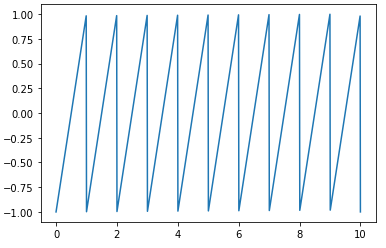


**Returns**

&nbsp;&nbsp;&nbsp;&nbsp;(`BpfInterface`) A periodic view of this bpf

----------

### plot


```python

BpfInterface.plot(self, kind=u'line', int n=-1, show=True, axes=None, **keys)

```


Plot the bpf using matplotlib.pyplot. Any key is passed to plot.plot_coords


#### Example

```python

from bpf4 import *
a = linear(0, 0, 1, 10, 2, 0.5)
a.plot()

# Plot to a preexistent axes
ax = plt.subplot()
a.plot(axes=ax)
```


**Args**

* **kind** (`str`): one of 'line', 'bar'
* **n** (`int`): the number of points to plot
* **show** (`bool`): if the plot should be shown immediately after (default is
    True).         If you want to display multiple BPFs sharing an axes you can
    call          plot on each of the bpfs with show=False, and then either
    call the last one with plot=True or call bpf4.plot.show().
* **axes** (`matplotlib.pyplot.Axes`): if given, will be used to plot onto it,
    otherwise an ad-hoc axes is created
* **keys**:

----------

### preapply


```python

BpfInterface.preapply(self, func)

```


Create a bpf where `func` is applied to the argument before it is passed


This is equivalent to `func(x) | self`

#### Example

```python

>>> bpf = Linear((0, 1, 2), (0, 10, 20))
>>> bpf(0.5)
5

>>> shifted_bpf = bpf.preapply(lambda x: x + 1)
>>> shifted_bpf(0.5)
15
```

**NB**: `bpf1.preapply(bpf2)` is the same as `bpf2 | bpf1`


**Args**

* **func** (`callable`): a function `func(x: float) -> float` which is applied
    to         the argument before passing it to this bpf

**Returns**

&nbsp;&nbsp;&nbsp;&nbsp;(`BpfInterface`) A bpf following the pattern `lambda x: bpf(func(x))`

----------

### rand


```python

BpfInterface.rand(self) -> _BpfRand

```


A bpf representing rand(self(x))


**Returns**

&nbsp;&nbsp;&nbsp;&nbsp;(`BpfInterface`) A bpf representing the operation ``rand(self(x))`

----------

### render


```python

BpfInterface.render(self, xs, interpolation=u'linear')

```


Create a new bpf representing this bpf rendered at the given points


The difference between `.render` and `.sampled` is that this method
creates a Linear/NoInterpol bpf whereas `.sampled` returns a 
`Sampled` bpf (a `Sampled` bpf works only for regularly sampled data,
a Linear or NoInterpol bpfs accept any data as its x coordinate)

#### Example

```python

>>> from bpf4 import *
>>> from math import *
>>> a = slope(1)[0:4*pi].sin()
>>> b = a.render(20)   # Sample this bpf at 20 points within its bounds
>>> b
Sampled[0.0:12.566370614359172]
>>> b.plot()
```


!!! info "See Also"

    [BpfInterface.sampled](#sampled)


**Args**

* **xs** (`int | list | np.ndarray`): a seq of points at which this bpf
    is sampled or a number, in which case an even grid is calculated
    with that number of points. In the first case a Linear or NoInterpol
    bpf is returned depending on the `interpolation` parameter (see below).
    In the second case a `Sampled` bpf is returned.
* **interpolation** (`str`): the interpoltation type of the returned bpf.
    One of 'linear', 'nointerpol'

**Returns**

&nbsp;&nbsp;&nbsp;&nbsp;(`BpfInterface`) a new bpf representing this bpf. Depending on the interpolation this new bpf will be a Sampled, a Linear or a NoInterpol bpf

----------

### round


```python

BpfInterface.round(self) -> _BpfLambdaRound

```


A bpf representing round(self(x))


**Returns**

&nbsp;&nbsp;&nbsp;&nbsp;(`BpfInterface`) A bpf representing the operation `round(self(x))`

----------

### sample\_between


```python

BpfInterface.sample_between(self, double x0, double x1, double dx, ndarray out=None) -> ndarray

```


Sample this bpf at an interval of dx between x0 and x1


!!! note

    The interface is similar to numpy's `linspace`

#### Example

```python

>>> a = linear(0, 0, 10, 10)
>>> a.sample_between(0, 10, 1)
[0 1 2 3 4 5 6 7 8 9 10]
```

This is the same as `a.mapn_between(11, 0, 10)`


**Args**

* **x0** (`float`): point to start sampling (included)
* **x1** (`float`): point to stop sampling (included)
* **dx** (`float`): the sampling period
* **out** (`ndarray`): if given, the result will be placed here and no new array
    will         be allocated

**Returns**

&nbsp;&nbsp;&nbsp;&nbsp;(`ndarray`) An array with the values of this bpf sampled at at a regular grid of period `dx` from `x0` to `x1`. If out is given the result is placed in it

----------

### sampled


```python

BpfInterface.sampled(self, double dx, interpolation=u'linear') -> BpfInterface

```


Sample this bpf at a regular interval, returns a Sampled bpf


Sample this bpf at an interval of dx (samplerate = 1 / dx)
returns a Sampled bpf with the given interpolation between the samples

!!! note

    If you need to sample a portion of the bpf, use [sampled_between](#sampled_between)

The same results can be achieved via indexing, in which case the resulting
bpf will be linearly interpolated:

```python
bpf[::0.1]    # returns a sampled version of this bpf with a dx of 0.1
bpf[:10:0.1]  # samples this bpf between (x0, 10) at a dx of 0.1
```

!!! info "See Also"

    [ntodx](#ntodx), [dxton](#dxton)


**Args**

* **dx** (`float`): the sample interval
* **interpolation** (`str`): the interpolation kind. One of 'linear',
    'nointerpol', 'halfcos', 'expon(XX)', 'halfcos(XX)' (where         XX is an
    exponential passed to the interpolation function)

**Returns**

&nbsp;&nbsp;&nbsp;&nbsp;(`Sampled`) The sampled bpf

----------

### sampled\_between


```python

BpfInterface.sampled_between(self, double x0, double x1, double dx, interpolation=u'linear') -> BpfInterface

```


Sample a portion of this bpf, returns a `Sampled` bpf


**NB**: This is the same as `thisbpf[x0:x1:dx]`


**Args**

* **x0** (`float`): point to start sampling (included)
* **x1** (`float`): point to stop sampling (included)
* **dx** (`float`): the sampling period
* **interpolation** (`str`): the interpolation kind. One of 'linear',
    'nointerpol', 'halfcos', 'expon(XX)', 'halfcos(XX)' (where         XX is an
    exponential passed to the interpolation function). For

**Returns**

&nbsp;&nbsp;&nbsp;&nbsp;(`Sampled`) The `Sampled` bpf, representing this bpf sampled at a grid of `[x0:x1:dx]` with the given interpolation

----------

### shifted


```python

BpfInterface.shifted(self, dx) -> BpfInterface

```


Returns a view of this bpf shifted by `dx` over the x-axes


This is the same as [.shift](#shift), but a new bpf is returned

#### Example

```python

>>> from bpf4 import *
>>> a = linear(0, 1, 1, 5)
>>> b = a.shifted(2)
>>> b(3) == a(1)
```


**Args**

* **dx**:

----------

### sin


```python

BpfInterface.sin(self) -> _BpfUnaryFunc

```


Returns a bpf representing the sine of this bpf


```
from bpf4 import *
from math import pi
a = slope(1).sin()
a[0:8*pi].plot()
```


----------

### sinh


```python

BpfInterface.sinh(self) -> _BpfUnaryFunc

```


Returns a bpf representing the sinh of this bpf

----------

### sqrt


```python

BpfInterface.sqrt(self) -> _BpfUnaryFunc

```


Returns a bpf representing the sqrt of this bpf

----------

### stretched


```python

BpfInterface.stretched(self, double rx, double fixpoint=0.)

```


Returns a view of this bpf stretched over the x axis.


**NB**: to stretch over the y-axis, just multiply this bpf

!!! info "See Also"

    [fit_between()](#fit_between)

#### Example

Stretch the shape of the bpf, but preserve the start position

```python

>>> a = linear(1, 1, 2, 2)
>>> b = a.stretched(4, fixpoint=a.x0)
>>> b.bounds()
(1, 9)
>>> a.plot(show=False); b.plot()

```


**Args**

* **rx** (`float`): the stretch factor
* **fixpoint** (`float`): the point to use as reference

**Returns**

&nbsp;&nbsp;&nbsp;&nbsp;(`BpfInterface`) A projection of this bpf stretched/compressed by by the given factor

----------

### tan


```python

BpfInterface.tan(self) -> _BpfUnaryFunc

```


Returns a bpf representing the tan of this bpf

----------

### tanh


```python

BpfInterface.tanh(self) -> _BpfUnaryFunc

```


Returns a bpf representing the tanh of this bpf


```python
from bpf4 import *
a = slope(1).tanh()
a[-4:4].plot()
```


----------

### zeros


```python

BpfInterface.zeros(self, double h=0.01, int N=0, double x0=NAN, double x1=NAN, int maxzeros=0) -> list

```


Find the zeros of this bpf


#### Example

```python

>>> a = bpf.linear(0, -1, 1, 1)
>>> a.zeros()
[0.5]

```


**Args**

* **h**: the accuracy to scan for zero-crossings. If two zeros are within
    this distance, they will be resolved as one.
* **N**: alternatively, you can give the number of intervals to scan.         h
    will be derived from this
* **x0**: the point to start searching. If not given, the starting point of this
    bpf         will be used
* **x1**: the point to stop searching. If not given, the end point of this bpf
    is used
* **maxzeros**: if > 0, stop the search when this number of zeros have been
    found

**Returns**

&nbsp;&nbsp;&nbsp;&nbsp;(`List[float]`) A list with the zeros of this bpf


---------


## BpfBase

 - Base Class: [BpfInterface](#bpfinterface)

### 


```python

BpfBase(xs, ys)

```

**Attributes**

* **descriptor**: A string describing the interpolation function of this bpf

* **exp**: The exponential of the interpolation function of this bpf


---------


**Methods**

### \_\_init\_\_


```python

def __init__(xs: list[float] | numpy.ndarray, ys: list[float] | numpy.ndarray
             ) -> None

```


Base constructor for bpfs


xs and ys should be of the same size


**Args**

* **xs** (`list[float] | numpy.ndarray`): x data
* **ys** (`list[float] | numpy.ndarray`): y data

----------

### clone\_with\_new\_data


```python

BpfBase.clone_with_new_data(self, ndarray xs: ndarray, ndarray ys: ndarray) -> BpfInterface

```


Create a new bpf with the same attributes as self but with new data


**Args**

* **xs** (`ndarray`): the x-coord data
* **ys** (`ndarray`): the y-coord data

**Returns**

&nbsp;&nbsp;&nbsp;&nbsp;(`BpfInterface`) The new bpf. It will be of the same class as self

----------

### insertpoint


```python

BpfBase.insertpoint(self, double x, double y)

```


Return **a copy** of this bpf with the point `(x, y)` inserted


!!! note

    *self* is not modified


**Args**

* **x** (`float`): x coord
* **y** (`float`): y coord

**Returns**

&nbsp;&nbsp;&nbsp;&nbsp;(`BpfInterface`) A clone of this bpf with the point inserted

----------

### mapn\_between


```python

def mapn_between(self, n, xstart, xend, out) -> None

```


BpfBase.mapn_between(self, int n, double xstart, double xend, ndarray out=None) -> ndarray


**Args**

* **n**:
* **xstart**:
* **xend**:
* **out**:

----------

### outbound


```python

BpfBase.outbound(self, double y0, double y1)

```


Set the values **inplace** returned when this bpf is evaluated outside its bounds.


The default behaviour is to interpret the values at the bounds to extend to infinity.

In order to not change this bpf inplace, use `b.copy().outbound(y0, y1)`


**Args**

* **y0**:
* **y1**:

----------

### points


```python

BpfBase.points(self)

```


Returns a tuple with the points defining this bpf


#### Example

```python

>>> b = Linear.fromseq(0, 0, 1, 100, 2, 50)
>>> b.points()
([0, 1, 2], [0, 100, 50])
```


**Returns**

&nbsp;&nbsp;&nbsp;&nbsp;(`tuple[ndarray, ndarray]) a tuple (xs, ys`) where `xs` is an array holding the values for the *x* coordinate, and `ys` holds the values for the *y* coordinate

----------

### removepoint


```python

BpfBase.removepoint(self, double x)

```


Return a copy of this bpf with point at x removed


Raises `ValueError` if x is not in this bpf

To remove elements by index, do:

```python

xs, ys = mybpf.points()
xs = numpy.delete(xs, indices)
ys = numpy.delete(ys, indices)
mybpf = mybpf.clone_with_new_data(xs, ys)

```


**Args**

* **x** (`float`): the x point to remove

**Returns**

&nbsp;&nbsp;&nbsp;&nbsp;(`BpfInterface`) A copy of this bpf with the given point removed

----------

### segments


```python

BpfBase.segments(self)

```


Return an iterator over the segments of this bpf


Each segment is a tuple `(x: float, y: float, interpoltype: str, exponent: float)`

Exponent is only of value if the interpolation type makes use of it.


**Returns**

&nbsp;&nbsp;&nbsp;&nbsp;(`Iterable[tuple[float, float, str, float]]`) An iterator of segments, where each segment has the form `(x, y, interpoltype:str, exponent)`

----------

### shift


```python

BpfBase.shift(self, double dx)

```


Shift the bpf along the x-coords, **INPLACE**


Use [.shifted](#shifted) to create a new bpf


**Args**

* **dx** (`float`): the shift interval

----------

### stretch


```python

BpfBase.stretch(self, double rx)

```


Stretch or compress this bpf in the x-coordinate **INPLACE**


**NB**: use `stretched` to create a new bpf


**Args**

* **rx** (`float`): the stretch/compression factor


---------


## Expon

 - Base Class: [BpfBase](#bpfbase)

### 


```python

Expon(xs, ys, double exp, int numiter=1)

```


A bpf with exponential interpolation


#### Example

```python
from bpf4 import *
import matplotlib.pyplot as plt
numplots = 5
fig, axs = plt.subplots(2, numplots, tight_layout=True, figsize=(20, 8))
for i in range(numplots):
    exp = i+1
    core.Expon([0, 1, 2], [0, 1, 0], exp=exp).plot(show=False, axes=axs[0, i])
    core.Expon([0, 1, 2], [0, 1, 0], exp=1/exp).plot(show=False, axes=axs[1, i])
    axs[0, i].set_title(f'{exp=}')
    axs[1, i].set_title(f'exp={1/exp:.2f}')

plot.show()

```


---------


**Methods**

### \_\_init\_\_


```python

def __init__(xs: ndarray, ys: ndarray, exp: float, numiter: int) -> None

```


**Args**

* **xs** (`ndarray`): the x-coord data
* **ys** (`ndarray`): the y-coord data
* **exp** (`float`): an exponent applied to the halfcosine interpolation
* **numiter** (`int`): how many times to apply the interpolation


---------


## Exponm

 - Base Class: [Expon](#expon)

### 


```python

Exponm(xs, ys, double exp, int numiter=1)

```


A bpf with symmetrical exponential interpolation


```python
from bpf4 import *
import matplotlib.pyplot as plt
numplots = 5
fig, axs = plt.subplots(2, numplots, tight_layout=True, figsize=(20, 8))
for i in range(numplots):
    exp = i+1
    core.Exponm([0, 1, 2], [0, 1, 0], exp=exp).plot(show=False, axes=axs[0, i])
    core.Exponm([0, 1, 2], [0, 1, 0], exp=1/exp).plot(show=False, axes=axs[1, i])
    axs[0, i].set_title(f'{exp=}')
    axs[1, i].set_title(f'exp={1/exp:.2f}')

plot.show()
```


---------


**Methods**

### \_\_init\_\_


```python

def __init__(xs: ndarray, ys: ndarray, exp: float, numiter: int) -> None

```


**Args**

* **xs** (`ndarray`): the x-coord data
* **ys** (`ndarray`): the y-coord data
* **exp** (`float`): an exponent applied to the halfcosine interpolation
* **numiter** (`int`): how many times to apply the interpolation


---------


## Halfcos

 - Base Class: [BpfBase](#bpfbase)

### 


```python

Halfcos(xs, ys, double exp=1.0, int numiter=1)

```


A bpf with half-cosine interpolation


[HalfcosExp](#HalfcosExp) is the same as Halfcos. It exists with two
names for compatibility

```python
a = core.Halfcos([0, 1, 3, 10], [0.1, 0.5, 3.5,  1])
b = core.Halfcos(*a.points(), exp=2)
c = core.Halfcos(*a.points(), exp=0.5)
fig, axes = plt.subplots(1, 3, figsize=(16, 4), tight_layout=True)
a.plot(axes=axes[0], show=False)
b.plot(axes=axes[1], show=False)
c.plot(axes=axes[2])
```
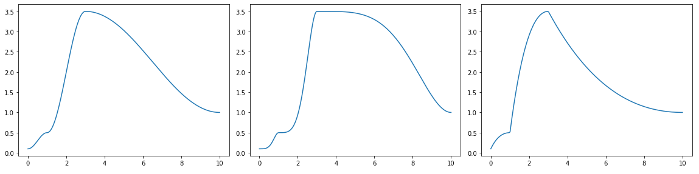


---------


**Methods**

### \_\_init\_\_


```python

def __init__(xs: ndarray, ys: ndarray, exp: float, numiter: int) -> None

```


**Args**

* **xs** (`ndarray`): the x-coord data
* **ys** (`ndarray`): the y-coord data
* **exp** (`float`): an exponent applied to the halfcosine interpolation
* **numiter** (`int`): how many times to apply the interpolation


---------


## Halfcosm

 - Base Class: [Halfcos](#halfcos)

### 


```python

Halfcosm(xs, ys, double exp=1.0, int numiter=1)

```


A bpf with half-cosine and exponent depending on the orientation of the interpolation


When interpolating between two y values, y0 and y1, if  y1 < y0 the exponent
is inverted, resulting in a symmetrical interpolation shape

```python
a = core.Halfcos([0, 1, 3, 10], [0.1, 0.5, 3.5,  1], exp=2)
b = core.Halfcosm(*a.points(), exp=2)
fig, axes = plt.subplots(1, 2, figsize=(16, 4))
a.plot(axes=axes[0], show=False)
b.plot(axes=axes[1])
```
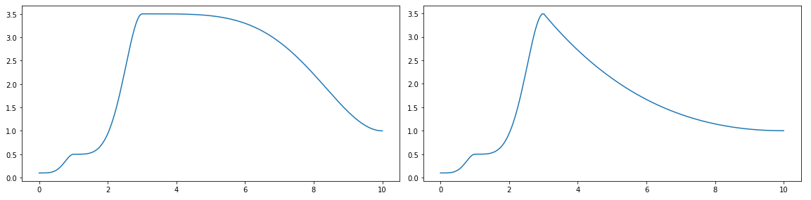


---------


## Linear

 - Base Class: [BpfBase](#bpfbase)

### 


```python

Linear(xs, ys)

```


A bpf with linear interpolation


```python
from bpf4 import *
a = core.Linear([0, 2, 3.5, 10], [0.1, 0.5, -3.5,  4])
a.plot()
```


---------


**Methods**

### \_\_init\_\_


```python

def __init__(xs: ndarray, ys: ndarray) -> None

```


**Args**

* **xs** (`ndarray`): the x-coord data
* **ys** (`ndarray`): the y-coord data

----------

### flatpairs


```python

Linear.flatpairs(self)

```


Returns a flat 1D array with x and y values interlaced


```python

>>> a = linear(0, 0, 1, 10, 2, 20)
>>> a.flatpairs()
array([0, 0, 1, 10, 2, 20])

```


**Returns**

&nbsp;&nbsp;&nbsp;&nbsp;(`ndarray`) A 1D array representing the points of this bpf with *xs* and *ys* interleaved

----------

### integrate\_between


```python

Linear.integrate_between(self, double x0, double x1, size_t N=0) -> double

```


Integrate this bpf between the given x coords


**Args**

* **x0** (`float`): start of integration
* **x1** (`float`): end of integration
* **N** (`int`): number of integration steps

**Returns**

&nbsp;&nbsp;&nbsp;&nbsp;(`float`) The result representing the area beneath the curve between *x0* and *x1*

----------

### inverted


```python

Linear.inverted(self)

```


Return a new Linear bpf where x and y coordinates are inverted.


This is only possible if y never decreases in value. Otherwise
a `ValueError` is thrown


**Returns**

&nbsp;&nbsp;&nbsp;&nbsp;(`Linear`) The inverted bpf

----------

### sliced


```python

Linear.sliced(self, double x0, double x1) -> Linear

```


Cut this bpf at the given points


If needed it inserts points at the given coordinates to limit this bpf to 
the range `x0:x1`.

**NB**: this is different from crop, which is just a "view" into the underlying
bpf. In this case a real `Linear` bpf is returned. 


**Args**

* **x0** (`float`): start x to cut
* **x1** (`float`): end x to cut

**Returns**

&nbsp;&nbsp;&nbsp;&nbsp;(`Linear`) Copy of this bpf cut at the given x-coords


---------


## Nearest

 - Base Class: [BpfBase](#bpfbase)

### 


```python

Nearest(xs, ys)

```


A bpf with nearest interpolation


```python
a = core.Linear([0, 1, 3, 10], [0.1, 0.5, 3.5,  1])
b = core.NoInterpol(*a.points())
c = core.Nearest(*a.points())
fig, axes = plt.subplots(1, 3, figsize=(15, 4), tight_layout=True)
a.plot(axes=axes[0], show=False)
b.plot(axes=axes[1], show=False)
c.plot(axes=axes[2])
```
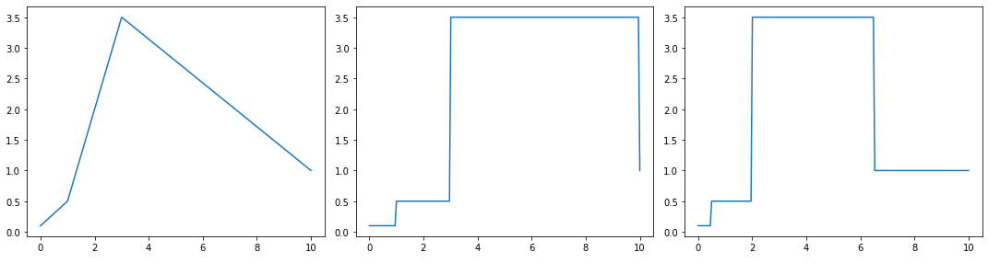


---------


**Methods**

### \_\_init\_\_


```python

def __init__(xs: ndarray, ys: ndarray) -> None

```


A bpf with nearest interpolation


**Args**

* **xs** (`ndarray`): the x coord data
* **ys** (`ndarray`): the y coord data


---------


## NoInterpol

 - Base Class: [BpfBase](#bpfbase)

### 


```python

NoInterpol(xs, ys)

```


A bpf without interpolation


```python
a = core.Linear([0, 1, 3, 10], [0.1, 0.5, 3.5,  1])
b = core.NoInterpol(*a.points())
c = core.Nearest(*a.points())
fig, axes = plt.subplots(1, 3, figsize=(15, 4), tight_layout=True)
a.plot(axes=axes[0], show=False)
b.plot(axes=axes[1], show=False)
c.plot(axes=axes[2])
```


---------


**Methods**

### \_\_init\_\_


```python

def __init__(xs: ndarray, ys: ndarray) -> None

```


A bpf without interpolation


**Args**

* **xs** (`ndarray`): the x coord data
* **ys** (`ndarray`): the y coord data


---------


## Smooth

 - Base Class: [BpfBase](#bpfbase)

### 


```python

Smooth(xs, ys, int numiter=1)

```


A bpf with smoothstep interpolation.


```python

>>> a = Smooth([0, 1, 3, 10], [0.1, 0.5, -3.5,  1])
>>> a.plot()
```


```python
>>> a = core.Smooth([0, 1, 3, 10], [0.1, 0.5, -3.5,  1], numiter=3)
>>> a.plot()
```


---------


**Methods**

### \_\_init\_\_


```python

def __init__(xs: ndarray, ys: ndarray, numiter: int) -> None

```


**Args**

* **xs** (`ndarray`): the x-coord data
* **ys** (`ndarray`): the y-coord data
* **numiter** (`int`): the number of smoothstep steps


---------


## Smoother

 - Base Class: [BpfBase](#bpfbase)

### 


```python

Smoother(xs, ys)

```


A bpf with smootherstep interpolation (perlin's variation of smoothstep)


```python

a = core.Smooth([0, 1, 3, 10], [0.1, 0.5, -3.5,  1])
b = core.Smoother(*a.points())
fig, axes = plt.subplots(1, 2, figsize=(12, 4))
a.plot(axes=axes[0], show=False)
b.plot(axes=axes[1])
```
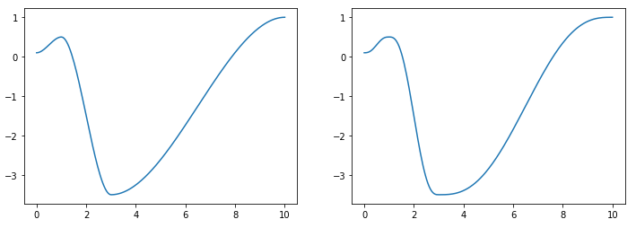


---------


## Const

 - Base Class: [BpfInterface](#bpfinterface)

### 


```python

Const(double value, bounds: tuple[float, float] = None)

```


A bpf representing a constant value


---------


**Methods**

### \_\_init\_\_


```python

def __init__(value: float) -> None

```


**Args**

* **value** (`float`): the constant value of this bpf

----------

### mapn\_between


```python

def mapn_between(self, n, x0, x1, out) -> None

```


Const.mapn_between(self, int n, double x0, double x1, ndarray out=None) -> ndarray


**Args**

* **n**:
* **x0**:
* **x1**:
* **out**:


---------


## Multi

 - Base Class: [BpfInterface](#bpfinterface)

### 


```python

Multi(xs, ys, interpolations)

```


A bpf where each segment can have its own interpolation kind


---------


**Methods**

### \_\_init\_\_


```python

def __init__(xs: ndarray, ys: ndarray, interpolations: list[str]) -> None

```


!!! note

    ```python

    len(interpolations) == len(xs) - 1

    ```

The interpelation is indicated via a descriptor: `'linear'` (linear), `'expon(x)'` 
(exponential with exp=x), `'halfcos'`, `'halfcos(x)'` (cosine interpol with exp=x),
`'nointerpol'`, ``'smooth'` (smoothstep)


**Args**

* **xs** (`ndarray`): the sequence of x points
* **ys** (`ndarray`): the sequence of y points
* **interpolations** (`list[str]`): the interpolation used between these points

----------

### segments


```python

Multi.segments(self)

```


Returns an iterator over the segments of this bpf


**Returns**

&nbsp;&nbsp;&nbsp;&nbsp;(`Iterator[tuple[float, float, str, float]]`) An iterator of segments, where each segment has the form `(x, y, interpoltype:str, exponent)`


---------


## Sampled

 - Base Class: [BpfInterface](#bpfinterface)

### 


```python

Sampled(samples, double dx, double x0=0, unicode interpolation=u'linear')

```


A bpf with regularly sampled data


When evaluated, values between the samples are interpolated with
a given function: linear, expon(x), halfcos, halfcos(x), etc.

**Attributes**

* **dx**: The sampling period (delta x)

* **interpolation**

* **samplerate**: The samplerate of this bpf

* **xs**: The x-coord array of this bpf

* **ys**


---------


**Methods**

### \_\_init\_\_


```python

def __init__(samples: ndarray, dx: float, x0: float, interpolation: str) -> None

```


**Args**

* **samples** (`ndarray`): the y-coord sampled data
* **dx** (`float`): the sampling **period**
* **x0** (`float`): the first x-value
* **interpolation** (`str`): the interpolation function used. One of 'linear',
    'nointerpol', 'expon(X)', 'halfcos', 'halfcos(X)', 'smooth',
    'halfcosm', etc.

----------

### derivative


```python

Sampled.derivative(self) -> BpfInterface

```


Return a curve which represents the derivative of this curve


It implements Newtons difference quotiont, so that:


    derivative(x) = bpf(x + h) - bpf(x)
                    -------------------
                              h

#### Example

```python

>>> from bpf4 import *
>>> a = slope(1)[0:6.28].sin()
>>> a.plot(show=False, color="red")
>>> b = a.derivative()
>>> b.plot(color="blue")

```


----------

### flatpairs


```python

Sampled.flatpairs(self)

```


Returns a flat 1D array with x and y values interlaced


```python
>>> a = linear(0, 0, 1, 10, 2, 20)
>>> a.flatpairs()
array([0, 0, 1, 10, 2, 20])
```


**Returns**

&nbsp;&nbsp;&nbsp;&nbsp;(`ndarray`) A 1D array with x and y values interlaced

----------

### integrate


```python

Sampled.integrate(self) -> double

```


Return the result of the integration of this bpf.


If any of the bounds is `inf`, the result is also `inf`.

**NB**: to determine the limits of the integration, first crop the bpf via a slice

#### Example

Integrate this bpf from its lower bound to 10 (inclusive)

```python
b[:10].integrate()  
```

----------

### integrate\_between


```python

Sampled.integrate_between(self, double x0, double x1, size_t N=0) -> double

```


The same as integrate() but between the (included) bounds x0-x1


It is effectively the same as `bpf[x0:x1].integrate()`, but more efficient

**NB**: N has no effect. It is put here to comply with the signature of the function. 


**Args**

* **x0**:
* **x1**:
* **N**:

----------

### inverted


```python

Sampled.inverted(self)

```


Return a view on this bpf with the coords inverted


In an inverted function the coordinates are swaped: the inverted version of a 
bpf indicates which *x* corresponds to a given *y*

Returns None if the function is not invertible. For a function to be invertible, 
it must be strictly increasing or decreasing, with no local maxima or minima.


    f.inverted()(f(x)) = x


So if `y(1) == 2`, then `y.inverted()(2) == 1`


**Returns**

&nbsp;&nbsp;&nbsp;&nbsp;(`BpfInterface`) a view on this bpf with the coords inverted

----------

### mapn\_between


```python

Sampled.mapn_between(self, int n, double x0, double x1, ndarray out=None) -> ndarray

```


Return an array of `n` elements resulting of evaluating this bpf regularly


The x coordinates at which this bpf is evaluated are equivalent to `linspace(xstart, xend, n)`


**Args**

* **n** (`int`): the number of elements to generate
* **x0** (`float`): x to start mapping
* **x1** (`float`): x to end mapping
* **out** (`ndarray`): if given, result is put here

**Returns**

&nbsp;&nbsp;&nbsp;&nbsp;(`ndarray`) An array of this bpf evaluated at a grid [xstart:xend:dx], where *dx* is `(xend-xstart)/n`

----------

### points


```python

Sampled.points(self)

```


Returns a tuple with the points defining this bpf


#### Example

```python

>>> b = Linear.fromseq(0, 0, 1, 100, 2, 50)
>>> b.points()
([0, 1, 2], [0, 100, 50])
```


**Returns**

&nbsp;&nbsp;&nbsp;&nbsp;(`tuple[ndarray, ndarray]`) A tuple `(xs, ys)` where `xs` is an array holding the values for the *x* coordinate, and `ys` holds the values for the *y* coordinate

----------

### segments


```python

Sampled.segments(self)

```


Returns an iterator over the segments of this bpf


Each item is a tuple `(float x, float y, str interpolation_type, float exponent)`

**NB**: exponent is only relevant if the interpolation type makes use of it


**Returns**

&nbsp;&nbsp;&nbsp;&nbsp;(`Iterable[tuple[float, float, str, float]]`) An iterator of segments, where each segment has the form `(x, y, interpoltype:str, exponent)`

----------

### set\_interpolation


```python

Sampled.set_interpolation(self, unicode interpolation) -> Sampled

```


Sets the interpolation of this Sampled bpf, inplace


Returns *self*, so you can do:

```python

sampled = bpf[x0:x1:dx].set_interpolation('expon(2)')

```


**Args**

* **interpolation** (`str`): the interpolation kind

**Returns**

&nbsp;&nbsp;&nbsp;&nbsp;(`Sampled`) self


---------


## Slope

 - Base Class: [BpfInterface](#bpfinterface)

### 


```python

Slope(double slope, double offset=0, tuple bounds=None)

```


A bpf representing a linear equation `y = slope * x + offset`


```python

>>> from bpf4.core import *
>>> a = Slope(0.5, 1)
>>> a
Slope[-inf:inf]
>>> a[0:10].plot()
```
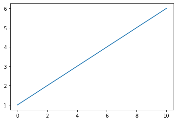

**Attributes**

* **offset**: offset: 'double'

* **slope**: slope: 'double'


---------


**Methods**

### \_\_init\_\_


```python

def __init__(slope: float, offset: float, bounds: tuple) -> None

```


A bpf representing a linear equation `y = slope * x + offset`


**Args**

* **slope** (`float`): the slope of the line
* **offset** (`float`): an offset added
* **bounds** (`tuple`): if given, the line is clipped on the x axis to the
    given bounds

----------

### mapn\_between


```python

Slope.mapn_between(self, int n, double x0, double x1, ndarray out=None) -> ndarray

```


Return an array of `n` elements resulting of evaluating this bpf regularly


The x coordinates at which this bpf is evaluated are equivalent to `linspace(x0, 1, n)`


**Args**

* **n** (`int`): the number of elements to generate
* **x0** (`float`): x to start mapping
* **x1** (`float`): x to end mapping
* **out** (`ndarray`): if given, result is put here

**Returns**

&nbsp;&nbsp;&nbsp;&nbsp;(`ndarray`) An array of this bpf evaluated at a grid [x0:x1:dx], where *dx* is `(xend-xstart)/n`


---------


## Spline

 - Base Class: [BpfInterface](#bpfinterface)

### 


```python

Spline(xs, ys)

```


A bpf with cubic spline interpolation


With cubic spline interpolation, for each point `(x, y)` 
it is ensured that `bpf(x) == y`. Between the defined points,
depending on their proximity, this bpf can overshoot

#### Example

```python
a = core.Smooth([0, 1, 3, 10], [0.1, 0.5, -3.5,  1])
b = core.Spline(*a.points())
fig, axes = plt.subplots(1, 2, figsize=(12, 4))
a.plot(axes=axes[0], show=False)
b.plot(axes=axes[1])
```
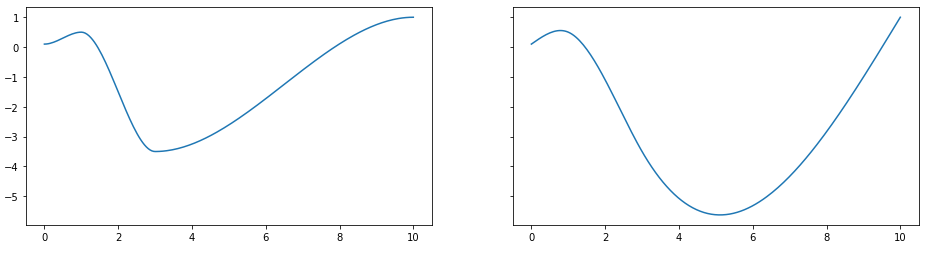


---------


**Methods**

### \_\_init\_\_


```python

def __init__(xs: ndarray, ys: ndarray) -> None

```


A bpf with cubic spline interpolation


**Args**

* **xs** (`ndarray`): the x coord data
* **ys** (`ndarray`): the y coord data

----------

### points


```python

Spline.points(self)

```


Returns a tuple with the points defining this bpf


#### Example

```python

>>> b = Linear.fromseq(0, 0, 1, 100, 2, 50)
>>> b.points()
([0, 1, 2], [0, 100, 50])
```


**Returns**

&nbsp;&nbsp;&nbsp;&nbsp;(`tuple[ndarray, ndarray]) a tuple (xs, ys`) where `xs` is an array holding the values for the *x* coordinate, and `ys` holds the values for the *y* coordinate

----------

### segments


```python

Spline.segments(self)

```


Returns an iterator over the segments of this bpf


Each segment is a tuple `(float x, float y, str interpolation_type, float exponent)`

!!! note

    Exponent is only relevant if the interpolation type makes use of it


**Returns**

&nbsp;&nbsp;&nbsp;&nbsp;(`Iterable[tuple[float, float, str, float]]`) An iterator of segments, where each segment has the form `(x, y, interpoltype:str, exponent)`


---------


## USpline

 - Base Class: [BpfInterface](#bpfinterface)

### 


```python

USpline(xs, ys)

```


bpf with univariate spline interpolation.


```python
a = core.Spline([0, 1, 3, 10], [0.1, 0.5, -3.5,  1])
b = core.USpline(*a.points())

fig, axes = plt.subplots(1, 2, figsize=(12, 4), sharey=True, tight_layout=True)
a.plot(axes=axes[0], show=False)
b.plot(axes=axes[1])
```
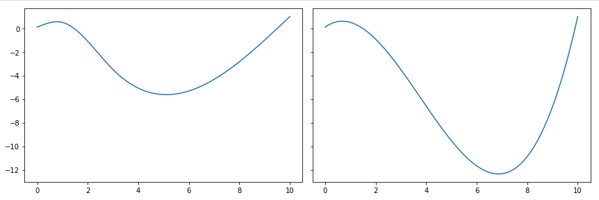


---------


**Methods**

### \_\_init\_\_


```python

def __init__(xs: ndarray, ys: ndarray) -> None

```


**Args**

* **xs** (`ndarray`): the x coord data
* **ys** (`ndarray`): the y coord data

----------

### map


```python

def map(self, xs, out) -> None

```


USpline.map(self, xs, ndarray out=None) -> ndarray


**Args**

* **xs**:
* **out**:

----------

### mapn\_between


```python

USpline.mapn_between(self, int n, double x0, double x1, ndarray out=None) -> ndarray

```


Return an array of `n` elements resulting of evaluating this bpf regularly


The x coordinates at which this bpf is evaluated are equivalent to `linspace(x0, x1, n)`


**Args**

* **n** (`int`): the number of elements to generate
* **x0** (`float`): x to start mapping
* **x1** (`float`): x to end mapping
* **out** (`ndarray`): if given, result is put here

**Returns**

&nbsp;&nbsp;&nbsp;&nbsp;(`ndarray`) An array of this bpf evaluated at a grid [xstart:xend:dx], where *dx* is `(xend-xstart)/n`

----------

### segments


```python

USpline.segments(self)

```


Returns an iterator over the segments of this bpf


**Returns**

&nbsp;&nbsp;&nbsp;&nbsp;(`Iterable[tuple[float, float, str, float]]`) An iterator of segments, where each segment has the form `(x, y, interpoltype:str, exponent)`


---------


## \_MultipleBpfs

 - Base Class: [BpfInterface](#bpfinterface)

### 


```python

_MultipleBpfs(bpfs)

```


---------


## Max

 - Base Class: [_MultipleBpfs](#_multiplebpfs)

### 


```python

Max(*bpfs)

```


A bpf which returns the max of multiple bpfs at a given point


```python
a = linear(0, 0, 1, 0.5, 2, 0)
b = expon(0, 0, 2, 1, exp=3)
a.plot(show=False, color="red", linewidth=4, alpha=0.3)
b.plot(show=False, color="blue", linewidth=4, alpha=0.3)
core.Max((a, b)).plot(color="black", linewidth=4, alpha=0.8, linestyle='dotted')
```


---------


## Min

 - Base Class: [_MultipleBpfs](#_multiplebpfs)

### 


```python

Min(*bpfs)

```


A bpf which returns the min of multiple bpfs at a given point


```python
a = linear(0, 0, 1, 0.5, 2, 0)
b = expon(0, 0, 2, 1, exp=3)
a.plot(show=False, color="red", linewidth=4, alpha=0.3)
b.plot(show=False, color="blue", linewidth=4, alpha=0.3)
core.Min((a, b)).plot(color="black", linewidth=4, alpha=0.8, linestyle='dotted')
```
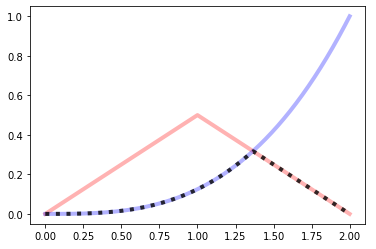


---------


## Stack

 - Base Class: [_MultipleBpfs](#_multiplebpfs)

### 


```python

Stack(bpfs)

```


A bpf representing a stack of bpf


Within a Stack, a bpf does not have outbound values. When evaluated
outside its bounds the bpf below is used, iteratively until the
lowest bpf is reached. Only the lowest bpf is evaluated outside its
bounds

#### Example

```python
# Interval    bpf
# [0, 3]      a
# (3, 4]      b
# (4, 10]     c

from bpf4 import *
import matplotlib.pyplot as plt

a = linear(0, 0, 3, 1)
b = linear(2, 9, 4, 10)
c = halfcos(0, 0, 10, 10)
s = core.Stack((a, b, c))

ax = plt.subplot(111)
a.plot(color="#f00", alpha=0.4, axes=ax, linewidth=4, show=False)
b.plot(color="#00f", alpha=0.4, axes=ax, linewidth=4, show=False)
c.plot(color="#f0f", alpha=0.4, axes=ax, linewidth=4, show=False)
s.plot(axes=ax, linewidth=2, color="#000", linestyle='dotted')
```
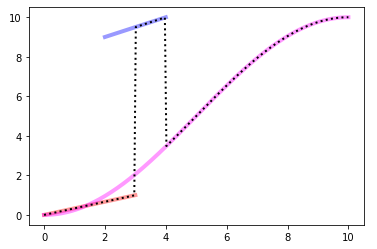


---------


**Methods**

### \_\_init\_\_


```python

def __init__(bpfs: list|tuple) -> None

```


**Args**

* **bpfs** (`list|tuple`): A sequence of bpfs. The order defined the evaluation
    order. The first bpf is on top, the last bpf is on bottom. Only         the
    last bpf is evaluated outside its bounds


---------


## blend


```python

blend(a, b, mix=0.5) -> BpfInterface

```


Blend these BPFs


!!! note

    if mix == 0: the result is *a*
    if mix == 1: the result is *b*


### Example

Create a curve which is in between a halfcos and a linear interpolation

```python
from bpf4 import *
a = halfcos(0, 0, 1, 1, exp=2)
b = linear(0, 0, 1, 1)
c = blend(a, b, 0.5)

a.plot(show=False, color="red")
b.plot(show=False, color="blue")
c.plot(color="green")

```
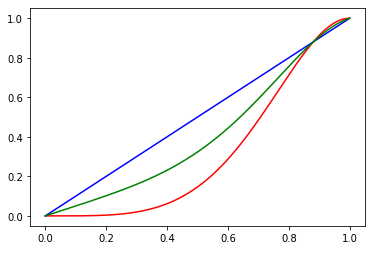

Closer to halfcos

```python
c = blend(a, b, 0.2)
a.plot(show=False, color="red")
b.plot(show=False, color="blue")
c.plot(color="green")
```


**Args**

* **a** (`BpfInterface`): first bpf
* **b** (`BpfInterface`): second bpf
* **mix** (`float | BpfInterface`): how to mix the bpfs. Can be fixed or
    itself a bpf (or any function) returning a value between 0-1

**Returns**

&nbsp;&nbsp;&nbsp;&nbsp;(`BpfInterface`) The blended bpf


---------


## bpf\_zero\_crossings


```python

bpf_zero_crossings(BpfInterface b, double h=0.01, int N=0, double x0=NAN, double x1=NAN, int maxzeros=0) -> list

```


Return the zeros if b in the interval defined


**Args**

* **b** (`BpfInterface`): a bpf
* **h** (`float`): the interval to scan for zeros. for each interval only one
    zero will be found
* **N** (`int`): alternatively you can give the number of intervals to scan. *h*
    will be calculated         from *N* (the *h* parameter is not used)
* **x0** (`float`): If given, the bounds to search within
* **x1** (`float`): If given, the bounds to search within
* **maxzeros** (`int`): if given, search will stop if this number of zeros is
    found

**Returns**

&nbsp;&nbsp;&nbsp;&nbsp;(`List[float]`) A list of zeros (x coord points where the bpf is 0)


---------


## brentq


```python

brentq(bpf, double x0, double xa, double xb, double xtol=9.9999999999999998e-13, double rtol=4.4408920985006262e-16, max_iter=100)

```


Calculate the zero of `bpf + x0` in the interval `(xa, xb)` using brentq algorithm


!!! note 

    To calculate all the zeros of a bpf, use [.zeros()](#zeros)


### Example

```python

# calculate the x where a == 0.5
>>> from bpf4 import *
>>> a = linear(0, 0, 10, 1)
>>> xzero, numcalls = brentq(a, -0.5, 0, 1)
>>> xzero
5
```


**Args**

* **bpf** (`BpfInterface`): the bpf to evaluate
* **x0** (`float`): an offset so that bpf(x) + x0 = 0
* **xa** (`float`): the starting point to look for a zero
* **xb** (`float`): the end point
* **xtol** (`float`): The computed root x0 will satisfy np.allclose(x, x0,
    atol=xtol, rtol=rtol) (*default*: `1e-12`)
* **rtol** (`float`): The computed root x0 will satisfy np.allclose(x, x0,
    atol=xtol, rtol=rtol) (*default*: `4.440892098500626e-16`)
* **max_iter** (`int`): the max. number of iterations (*default*: `100`)

**Returns**

&nbsp;&nbsp;&nbsp;&nbsp;(`tuple[float, int]`) A tuple (zero of the bpf, number of function calls)


---------


## setA4


```python

setA4(double freq)

```


Set the reference freq used


**Args**

* **freq** (`float`): the reference frequency for A4