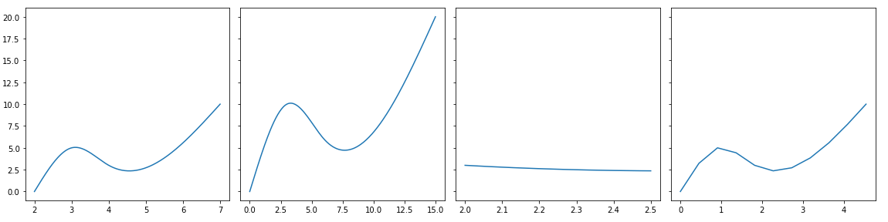
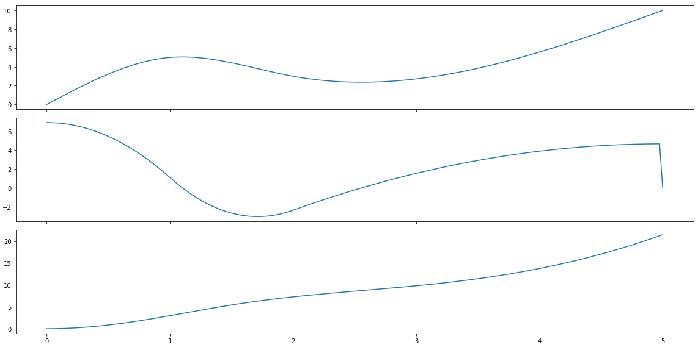
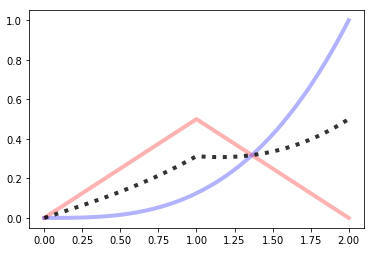
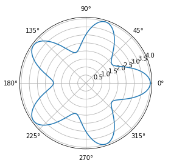

# bpf4

Welcome to the **bpf4** documentation!

**bpf4** is a python library to operate with curves in 2D space. Curves can be 
defined via breakpoints (break-point functions, hence the name), using functions or 
curves can be used to build other curves. It can be used to perform
curve fitting, data analysis, plotting, etc. It is mainly programmed
in cython for efficiency.

<https://github.com/gesellkammer/bpf4>

-----------------

## Installation

```bash
pip install bpf4
```

-----------------


## Quick Introduction


A BPF (Break-Point-Function) is defined by points in 2D space. Each different BPF defines
a specific interpolation type: linear, exponential, spline, etc. Operations on BPFs 
are lazy and result in new BPFs representing these operations. A BPF can be evaluated
at a specific x coord or an array of such coords or rendered with a given sampling 
period. 

All curve types implement the standard arithmetic methods (`+`, `-`, `*`, `/`, `**`, etc) 
plus all standard mathematical functions (`sin`, `cos`, `asin`, `log`, `sqrt`). Each operation
results in a new curve representing such operation and together they build a pipeline representing
a given function. When a curve is evaluated, each child curve is itself evaluated to generate
the numerical result. 

### Example 1

```python
>>> from bpf4 import *
>>> a = linear((0, 0), (1.5, 10), (3.4, 15))
>>> b = linear((1, 1), (4, 10))

# Construct a third BPF representing the average
>>> avgbpf = (a + b) / 2
>>> avgbpf
_BpfLambdaDivConst[0.0:4.0]

# Sample the bpf at a regular interval, generate 30 elements. This first
# samples curve `a` and `b`, then performs the binary operations
# on the resulting arrays, avoiding any extra allocation
>>> avgbpf.map(30)
array([ 0.5       ,  0.95977011,  2.67816092,  4.51724138,  6.35632184,
        7.29885057,  7.75862069,  8.2183908 ,  8.67816092,  9.13793103,
        9.59770115, 10.02268603, 10.20417423, 10.38566243, 10.56715064,
       10.74863884, 10.93012704, 11.11161525, 11.29310345, 11.47459165,
       11.65607985, 11.83756806, 12.01905626, 12.20054446, 12.38203267,
       12.5       , 12.5       , 12.5       , 12.5       , 12.5       ])

```

`avgbpf` is a BPF representing a set of mathematical operations. It is defined over a given range (the `bounds`
of the BPF). If not indicated otherwise outside of the bounds of the BPF its values remain constant:

```python
>>> a(3.4)
15
>>> a(10)
15
```

### Example 2: Intersection between two curves

```python

from bpf4 import *  
import matplotlib.pyplot as plt
a = spline((0, 0), (1, 5), (2, 3), (5, 10))  
b = expon((0, -10), (2,15), (5, 3), exp=3)
# plots are performed using matplotlib
a.plot() 
b.plot() 
zeros = (a - b).zeros()
plt.plot(zeros, a.map(zeros), 'o')
```


------------------


## Features


Many interpolation and curve-fitting types:

* spline
* univariate splie
* pchip (hermite)
* cosine
* exponential
* logarithmic
* etc. 

With the exception of curve-fitting bpfs, interpolation types can be mixed, so that each segment 
has a different interpolation. Following from the example above:  


```pyton

c = (a + b).sin().abs()
# plot only the range (1.5, 4)
c[1.5:4].plot()  

```


Syntax support for shifting, scaling and slicing a bpf

```python

from bpf4 import *
a = spline((0, 0), (1, 5), (2, 3), (5, 10))  
b = expon((0, -10), (2,15), (5, 3), exp=3)

shifted = a >> 2        # a shifted to the right
scaled = (a * 2) ^ 3   # scale the x coord by 3, scale the y coord by 2
cropped = a[2:2.5]      # slice only a portion of the bpf
sampled = a[::0.5]     # sample the bpf with an interval of 0.5

import matplotlib.pyplot as plt
fig, axs = plt.subplots(1, 4, figsize=(16, 4), sharey=True, tight_layout=True)
for curve, ax in zip((shifted,scaled, cropped, sampled), axs):
    curve.plot(axes=ax, show=False)
plt.show()
```


### Derivation / Integration

```python
from bpf4 import *
a = spline((0, 0), (1, 5), (2, 3), (5, 10))
deriv = a.derivative()
integr = a.integrated()

import matplotlib.pyplot as plt 
fig, axs = plt.subplots(3, 1, sharex=True, figsize=(16, 8), tight_layout=True)
a.plot(axes=axs[0], show=False)
deriv.plot(axes=axs[1], show=False)
integr.plot(axes=axs[2])
```



-------------------

## Mathematical operations

### Max / Min

```python
a = linear(0, 0, 1, 0.5, 2, 0)
b = expon(0, 0, 2, 1, exp=3)
a.plot(show=False, color="red", linewidth=4, alpha=0.3)
b.plot(show=False, color="blue", linewidth=4, alpha=0.3)
core.Max((a, b)).plot(color="black", linewidth=4, alpha=0.8, linestyle='dotted')
```


```python
a = linear(0, 0, 1, 0.5, 2, 0)
b = expon(0, 0, 2, 1, exp=3)
a.plot(show=False, color="red", linewidth=4, alpha=0.3)
b.plot(show=False, color="blue", linewidth=4, alpha=0.3)
core.Min((a, b)).plot(color="black", linewidth=4, alpha=0.8, linestyle='dotted')
```


### `+, -, *, /`

```
a = linear(0, 0, 1, 0.5, 2, 0)
b = expon(0, 0, 2, 1, exp=3)
a.plot(show=False, color="red", linewidth=4, alpha=0.3)
b.plot(show=False, color="blue", linewidth=4, alpha=0.3)
(a*b).plot(color="black", linewidth=4, alpha=0.8, linestyle='dotted')
```


```python
a = linear(0, 0, 1, 0.5, 2, 0)
b = expon(0, 0, 2, 1, exp=3)
a.plot(show=False, color="red", linewidth=4, alpha=0.3)
b.plot(show=False, color="blue", linewidth=4, alpha=0.3)
(a**b).plot(color="black", linewidth=4, alpha=0.8, linestyle='dotted')
```


```python
a = linear(0, 0, 1, 0.5, 2, 0)
b = expon(0, 0, 2, 1, exp=3)
a.plot(show=False, color="red", linewidth=4, alpha=0.3)
b.plot(show=False, color="blue", linewidth=4, alpha=0.3)
((a+b)/2).plot(color="black", linewidth=4, alpha=0.8, linestyle='dotted')
```


### Building functions

A bpf can be used to build complex formulas

**Fresnel's Integral**: \( S(x) = \int_0^x {sin(t^2)} dt \)

```python
t = slope(1)
f = (t**2).sin()[0:10:0.001].integrated()
f.plot()
```


#### Polar plots

Any kind of matplotlib plot can be used. For example, polar plots are possible
by creating an axes with *polar*=`True`

**Cardiod**: \(\rho = 1 + sin(-\theta) \)

```python

from math import *
theta = slope(1, bounds=(0, 2*pi))
r = 1 + (-theta).sin()

ax = plt.axes(polar=True)
ax.set_rticks([0.5, 1, 1.5, 2]); ax.set_rlabel_position(38)
r.plot(axes=ax)
```


**Flower 5**: \(\rho = 3 + cos(5 * \theta) \)

```python
theta = core.Slope(1, bounds=(0, 2*pi))
r = 3 + (5*theta).cos()

ax = plt.axes(polar=True)
r.plot(axes=ax)

```
