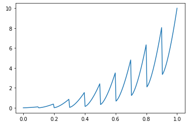

# util


Utilities for bpf4


---------


| Function  | Description  |
| :-------  | :----------- |
| `asbpf` | Convert obj to a bpf |
| `binarymask` | Creates a binary mask |
| `blendwithceil` | Returns a blend of b with its maximum y value |
| `blendwithfloor` | Returns a blend of b with its minimum y value |
| `bpf_to_csv` | Write this bpf as a csv representation |
| `bpf_to_dict` | convert a bpf to a dict with the following format |
| `bpf_to_json` | convert this bpf to json format. |
| `bpf_to_yaml` | Convert this bpf to json format. |
| `bpfavg` | Return a Bpf which is the average of b over the range `dx` |
| `calculate_projection` | Calculate a projection needed to map the interval x0:x1 to p0:p1 |
| `concat_bpfs` | Concatenate these bpfs together, one after the other |
| `csv_to_bpf` | Read a bpf from a csv file |
| `dict_to_bpf` | Convert a dict to a bpf |
| `dumpbpf` | Dump the data of this bpf as human readable text |
| `histbpf` | Create a historgram of *b* |
| `jagged_band` | Create a jagged bpf between lowerbpf and upperbpf at the x values given |
| `loadbpf` | Load a bpf saved with dumpbpf |
| `makebpf` | Create a bpf from the given descriptor and points |
| `max_` | Return a bpf representing the max over the given elements |
| `maximum` | return the x where bpf(x) is the maximum of bpf |
| `min_` | Return a bpf representing the min over elements |
| `minimum` | Find the x where bpf(x) is minimized |
| `multi_parseargs` | Parse args of a multi bpf |
| `parseargs` | Convert the args and kws to the canonical form (xs, ys, kws) |
| `parsedescr` | Parse interpolation description |
| `projection_fixedpoint` | Returns the fixed point given the projection parameters |
| `randombw` | Create a random bpf |
| `rms` | The rms of this bpf |
| `rmsbpf` | Return a bpf representing the rms of the given samples as a function of time |
| `select` | Create a new bpf which interpolates between adjacent bpfs |
| `simplify_linear_coords` | Simplify the linear bpf defined by the points xs and ys |
| `smoothen` | Return a bpf representing a smooth version of b |
| `split_fragments` | Split a bpf into its fragments |
| `sum_` | Return a bpf representing the sum of elements |
| `warped` | Represents the curvature of a linear space. |
| `zigzag` | Creates a curve formed of lines from b0(x) to b1(x) for each x in xs |


---------


## asbpf


```python

def asbpf(obj, bounds: tuple = (-inf, inf)) -> core.BpfInterface

```


Convert obj to a bpf


obj can be a function, a dict, a constant, or a bpf (in which case it
is returned as is)


**Args**

* **obj**:
* **bounds** (`tuple`):  (*default*: `(-inf, inf)`)


---------


## binarymask


```python

def binarymask(mask: str | list[int], durs: Sequence[float] = None, 
               offset: float = 0.0, cycledurs: bool = True) -> core.NoInterpol

```


Creates a binary mask


**Example**

```python

>>> mask = binarymask("x--x-x---")
```


**Args**

* **mask** (`str | list[int]`): a mask string ('x'=1, '-'=0) or a sequence of
    states (a state is either 0 or 1)
* **durs** (`Sequence[float]`): a sequence of durations (default=[1])
    (*default*: `None`)
* **offset** (`float`):  (*default*: `0.0`)
* **cycledurs** (`bool`):  (*default*: `True`)

**Returns**

&nbsp;&nbsp;&nbsp;&nbsp;(`core.NoInterpol`) A NoInterpol bpf representing the binary mask


---------


## blendwithceil


```python

def blendwithceil(b, mix: float = 0.5) -> core._BpfBlend

```


Returns a blend of b with its maximum y value


**Args**

* **b**:
* **mix** (`float`):  (*default*: `0.5`)


---------


## blendwithfloor


```python

def blendwithfloor(b: core.BpfInterface, mix: float = 0.5) -> core._BpfBlend

```


Returns a blend of b with its minimum y value


**Args**

* **b** (`core.BpfInterface`):
* **mix** (`float`):  (*default*: `0.5`)


---------


## bpf\_to\_csv


```python

def bpf_to_csv(bpf: core.BpfInterface, csvfile: str) -> None

```


Write this bpf as a csv representation


**Args**

* **bpf** (`core.BpfInterface`): the bpf to write as csv
* **csvfile** (`str`): the output filename


---------


## bpf\_to\_dict


```python

def bpf_to_dict(bpf: core.BpfInterface) -> dict

```


convert a bpf to a dict with the following format


```python

>>> b = bpf.expon(3.0, 0, 0, 1, 10, 2, 20)
>>> bpf_to_dict(b)
{
    'interpolation': 'expon(3.0)',
    'points': [0, 0, 1, 10, 20, 20]  # [x0, y0, x1, y1, ...]
}

>>> b = bpf.multi(0, 0, 'linear',
                  1, 10, 'expon(2)',
                  3, 25)
>>> bpf_to_dict(b)
{
    'interpolation': 'multi',
    'segments': [
        [0, 0, 'linear'],
        [1, 10, 'expon(2)',
        [3, 25, '']]
}
```


**Args**

* **bpf** (`core.BpfInterface`): the bpf to convert to a dict

**Returns**

&nbsp;&nbsp;&nbsp;&nbsp;(`dict`) The bpf as a dictionary


---------


## bpf\_to\_json


```python

def bpf_to_json(bpf: core.BpfInterface, outfile: str = None) -> str

```


convert this bpf to json format.


If outfile is not given, it returns a string, as in dumps


**Args**

* **bpf** (`core.BpfInterface`): the bpf to dump as json
* **outfile** (`str`): the output filename. If given, output is saved here
    (*default*: `None`)

**Returns**

&nbsp;&nbsp;&nbsp;&nbsp;(`str`) The json text


---------


## bpf\_to\_yaml


```python

def bpf_to_yaml(bpf: core.BpfInterface, outfile: str = None) -> str

```


Convert this bpf to json format.


**Args**

* **bpf** (`core.BpfInterface`): the bpf to convert
* **outfile** (`str`): if given, the yaml text is saved to this file (*default*:
    `None`)

**Returns**

&nbsp;&nbsp;&nbsp;&nbsp;(`str`) The yaml text


---------


## bpfavg


```python

def bpfavg(b: core.BpfInterface, dx: float) -> core.BpfInterface

```


Return a Bpf which is the average of b over the range `dx`


**Args**

* **b** (`core.BpfInterface`): the bpf
* **dx** (`float`): the period to average *b* over

**Returns**

&nbsp;&nbsp;&nbsp;&nbsp;(`core.BpfInterface`) a bpf representing the average of *b* along the bounds of *b* over a sliding period of *dx*


---------


## calculate\_projection


```python

def calculate_projection(x0, x1, p0, p1) -> tuple[float, float, float]

```


Calculate a projection needed to map the interval x0:x1 to p0:p1


**Args**

* **x0**:
* **x1**:
* **p0**:
* **p1**:

**Returns**

&nbsp;&nbsp;&nbsp;&nbsp;(`tuple[float, float, float]`) A tuple (rx, dx, offset)


---------


## concat\_bpfs


```python

def concat_bpfs(bpfs: list[core.BpfInterface]) -> core._BpfConcat

```


Concatenate these bpfs together, one after the other


**Args**

* **bpfs** (`list[core.BpfInterface]`):


---------


## csv\_to\_bpf


```python

def csv_to_bpf(csvfile: str) -> core.BpfInterface

```


Read a bpf from a csv file


**Args**

* **csvfile** (`str`):


---------


## dict\_to\_bpf


```python

def dict_to_bpf(d: dict) -> bpf.BpfInterface

```


Convert a dict to a bpf


**Format 1** 

```python

bpf = {
    'interpolation': 'expon(2)',
    10: 0.1,
    15: 1,
    25: -1
}
```

**Format 2**

```python
bpf = {
    'interpolation': 'linear',
    'points': [x0, y0, x1, y1, ...]
}
```

**Format 2b**

```python
bpf = {
    'interpolation': 'linear',
    'points': [(x0, y0), (x1, y1), ...]
}
```

**Format 3 (multi)**

```python

bpf = {
    'interpolation': 'multi',
    'segments': [
        [x0, y0, 'descr0'],
        [x1, y1, 'descr1'],
        ...
        [xn, yn, '']
    ]
}
```


**Args**

* **d** (`dict`): the dictionary to convert to a bpf

**Returns**

&nbsp;&nbsp;&nbsp;&nbsp;(`bpf.BpfInterface`) the converted bpf


---------


## dumpbpf


```python

def dumpbpf(bpf: core.BpfInterface, fmt: str = yaml) -> str

```


Dump the data of this bpf as human readable text


The bpf can then be reconstructed via `loadbpf`


**Args**

* **bpf** (`core.BpfInterface`): the bpf to dump
* **fmt** (`str`): the format, one of 'csv', 'yaml', 'json' (*default*: `yaml`)

**Returns**

&nbsp;&nbsp;&nbsp;&nbsp;(`str`) the text representation according to the format


---------


## histbpf


```python

def histbpf(b: core.BpfInterface, numbins: int = 20, numsamples: int = 400
            ) -> core.Linear

```


Create a historgram of *b*


### Example

```python

>>> from sndfileio import *
>>> import bpf4
>>> samples, sr = sndread("path/to/soundfile.wav")
>>> dbcurve = bpf4.util.rmsbpf(samples, sr=sr).amp2db()
>>> dbval2hist = bpf4.util.histbpf(dbcurve)
# Find the db percentile at a given time, this gives a measurement of the
# relative strength of the sound at a given moment
>>> dur = len(samples)/sr
>>> percentile = dbval2hist(dur*0.5)
0.312Z
>>> dbhist2val = dbval2hist.inverted()

```

This indicates that at the middle of the sound the amplitude is at percentile ~30


**Args**

* **b** (`core.BpfInterface`): the bpf
* **numbins** (`int`): the number of bins (*default*: `20`)
* **numsamples** (`int`): how many samples to take to determine the histogram
    (*default*: `400`)

**Returns**

&nbsp;&nbsp;&nbsp;&nbsp;(`core.Linear`) a bpf mapping values to percentiles. The returned bpf can be inverted (see example) to map percentiles to values


---------


## jagged\_band


```python

def jagged_band(xs: list[float], upperbpf: core.BpfInterface, lowerbpf: int = 0, 
                curve: str = linear) -> core.BpfInterface

```


Create a jagged bpf between lowerbpf and upperbpf at the x values given


At each x in xs the, the value is equal to lowerbpf, sweeping
with curvature 'curve' to upperbpf just before the next x

### Example

```python

from bpf4 import *
import numpy as np
a = expon(0, 0, 1, 10, exp=2)
b = expon(0, 0, 1, 5, exp=4)
j = util.jagged_band(list(np.arange(0, 1, 0.1)), a, b, curve='expon(1.5)')
j.plot()
```



**Args**

* **xs** (`list[float]`):
* **upperbpf** (`core.BpfInterface`):
* **lowerbpf** (`int`):  (*default*: `0`)
* **curve** (`str`):  (*default*: `linear`)


---------


## loadbpf


```python

def loadbpf(path: str, fmt: str = auto) -> core.BpfInterface

```


Load a bpf saved with dumpbpf


Possible formats: auto, csv, yaml, json


**Args**

* **path** (`str`): the path of the saved bpf
* **fmt** (`str`): the format used to save the bpf ('auto' to detect the format)
    (*default*: `auto`)

**Returns**

&nbsp;&nbsp;&nbsp;&nbsp;(`core.BpfInterface`) a bpf


---------


## makebpf


```python

def makebpf(descr: str, X: Sequence[float], Y: Sequence[float]
            ) -> core.BpfInterface

```


Create a bpf from the given descriptor and points


**Args**

* **descr** (`str`): a string descriptor of the interpolation ("linear",
    "expon(xx)", ...)
* **X** (`Sequence[float]`): the array of xs
* **Y** (`Sequence[float]`): the array of ys

**Returns**

&nbsp;&nbsp;&nbsp;&nbsp;(`core.BpfInterface`) the created bpf


---------


## max\_


```python

def max_(elements) -> core.Max

```


Return a bpf representing the max over the given elements


**Args**

* **elements**: each element can be a bpf or a scalar

**Returns**

&nbsp;&nbsp;&nbsp;&nbsp;(`core.Max`) a Max bpf


---------


## maximum


```python

def maximum(bpf: core.BpfInterface, N: int = 10) -> float | None

```


return the x where bpf(x) is the maximum of bpf


**Args**

* **bpf** (`core.BpfInterface`): the bpf to analyze
* **N** (`int`):  (*default*: `10`)

**Returns**

&nbsp;&nbsp;&nbsp;&nbsp;(`float | None`) is the maximum. Returns `None` if no maximum found


---------


## min\_


```python

def min_(elements) -> core.Min

```


Return a bpf representing the min over elements


**Args**

* **elements**: each can be a bpf or a scalar

**Returns**

&nbsp;&nbsp;&nbsp;&nbsp;(`core.Min`) a Min bpf


---------


## minimum


```python

def minimum(bpf: core.BpfInterface, N: int = 10) -> float | None

```


Find the x where bpf(x) is minimized


**Args**

* **bpf** (`core.BpfInterface`): the bpf to analyze
* **N** (`int`): the number of estimates (*default*: `10`)

**Returns**

&nbsp;&nbsp;&nbsp;&nbsp;(`float | None`) is minimized. Returns `None` if no minimum found


---------


## multi\_parseargs


```python

def multi_parseargs(args) -> tuple[list[float], list[float], list[str]]

```


Parse args of a multi bpf


Given a list of args of the form (x0, y0, interpol) or (x0, y0) (or a flat
version thereof), fills the possibly missing interpolation descriptions
and returns a tuple `(xs, ys, interpolations)`


**Args**

* **args**:

**Returns**

&nbsp;&nbsp;&nbsp;&nbsp;(`tuple[list[float], list[float], list[str]]`) a tuple (xs, ys, interpolations), where len(interpolations) == len(xs) - 1


---------


## parseargs


```python

def parseargs(args, kws) -> tuple[list[float], list[float], dict]

```


Convert the args and kws to the canonical form (xs, ys, kws)


Raises ValueError if failed

All the following variants result in the same result:

```python

x0, y0, x1, y1, …, exp=0.5
(x0, y0), (x1, y1), …, exp=0.5           
{x0:y0, x1:y1, …}, exp=0.5               
[x0, x1, …], [y0, y1, …], exp=0.5        

Result: [x0, x1, …], [y0, y1, …], {exp:0.5}
```


**Args**

* **args**:
* **kws**:

**Returns**

&nbsp;&nbsp;&nbsp;&nbsp;(`tuple[list[float], list[float], dict]`) A tuple `(xs, ys, kws)`


---------


## parsedescr


```python

def parsedescr(descr: str, validate: bool = True) -> tuple[str, dict]

```


Parse interpolation description


| descr                   | output                             |
|-------------------------|------------------------------------|
| linear                  | linear, {}                         |
| expon(0.4)              | expon, {'exp': 0.4}                |
| halfcos(2.5, numiter=1) | halfcos, {'exp':2.5, 'numiter': 1} |


**Args**

* **descr** (`str`):
* **validate** (`bool`):  (*default*: `True`)


---------


## projection\_fixedpoint


```python

def projection_fixedpoint(rx, dx, offset) -> None

```


Returns the fixed point given the projection parameters


x2 = (x-offset)*rx + dx

For a fixed point, x2 == x


**Args**

* **rx**:
* **dx**:
* **offset**:


---------


## randombw


```python

def randombw(bw: float | core.BpfInterface, center: float | core.BpfInterface
             ) -> core.BpfInterface

```


Create a random bpf


if randombw is 0.1 and center is 1, the bpf will render values 
between 0.95 and 1.05

!!! note

    This bpf will always be different, since the random numbers
    are calculated as needed. Sample it to freeze it to a known state.

**Example**

```python

>>> l = bpf.linear(0, 0, 1, 1)
>>> r = bpf.util.randombw(0.1)
>>> l2 = (l*r)[::0.01]
```


**Args**

* **bw** (`float | core.BpfInterface`): a (time-varying) bandwidth
* **center** (`float | core.BpfInterface`): the center of the random
    distribution

**Returns**

&nbsp;&nbsp;&nbsp;&nbsp;(`core.BpfInterface`) a bpf


---------


## rms


```python

def rms(bpf: core.BpfInterface, rmstime: float = 0.1) -> core.BpfInterface

```


The rms of this bpf


**Args**

* **bpf** (`core.BpfInterface`): the bpf
* **rmstime** (`float`): the time to calculate the rms over (*default*: `0.1`)

**Returns**

&nbsp;&nbsp;&nbsp;&nbsp;(`core.BpfInterface`) a bpf representing the rms of this bpf at any x coord


---------


## rmsbpf


```python

def rmsbpf(samples: np.ndarray, sr: int, dt: float = 0.01, overlap: int = 2, 
           smoothen: float = 0.0) -> core.BpfInterface

```


Return a bpf representing the rms of the given samples as a function of time


**Args**

* **samples** (`np.ndarray`): the audio samples
* **sr** (`int`): the sample rate
* **dt** (`float`): analysis time period (*default*: `0.01`)
* **overlap** (`int`): overlap of analysis frames (*default*: `2`)
* **smoothen** (`float`): if given, the returned bpf is smoothen using the given
    value as window (*default*: `0.0`)

**Returns**

&nbsp;&nbsp;&nbsp;&nbsp;(`core.BpfInterface`) a sampled bpf if not smoothening operation is performed, or a linear bpf if smoothening is required


---------


## select


```python

def select(which: core.BpfInterface, bpfs: Sequence[core.BpfInterface], 
           shape: str = linear) -> core._BpfSelect

```


Create a new bpf which interpolates between adjacent bpfs


**Example**

```python   

>>> which = nointerpol(0, 0, 5, 1)
>>> bpfs = [linear(0, 0, 10, 10), linear(0, 10, 10, 0)]
>>> s = select(which, bpfs)
>>> s(1)     # at time=1, the first bpf will be selected
0
```


**Args**

* **which** (`core.BpfInterface`): returns at any x, which bpf from bpfs should
    return the result
* **bpfs** (`Sequence[core.BpfInterface]`): a list of bpfs
* **shape** (`str`): interpolation shape between consecutive bpfs (*default*:
    `linear`)

**Returns**

&nbsp;&nbsp;&nbsp;&nbsp;(`core._BpfSelect`) a BpfSelect


---------


## simplify\_linear\_coords


```python

def simplify_linear_coords(xs: np.ndarray, ys: np.ndarray, 
                           threshold: float = 0.0, ratio: float = 0.0
                           ) -> tuple[np.ndarray, np.ndarray]

```


Simplify the linear bpf defined by the points xs and ys


**Args**

* **xs** (`np.ndarray`): the x coord array
* **ys** (`np.ndarray`): the y coord array
* **threshold** (`float`): the simplification threshold. Points which deviate
    less than this         value will be simplified. The first and last points
    are never simplified (*default*: `0.0`)
* **ratio** (`float`):  (*default*: `0.0`)

**Returns**

&nbsp;&nbsp;&nbsp;&nbsp;(`tuple[np.ndarray, np.ndarray]`) the simplified line as a tuple (xs, ys)


---------


## smoothen


```python

def smoothen(b: core.BpfInterface, window: float, N: int = 1000, 
             interpol: str = linear) -> core.BpfInterface

```


Return a bpf representing a smooth version of b


### Example

```python
>>> import bpf4 as bpf
>>> b = bpf.linear(0, 0, 0.1, 1, 0.2, 10, 0.3, 1, 0.5, 3, 0.8, -2)
>>> bsmooth = bpf.util.smoothen(b, window=0.05)
>>> axes = b.plot(show=False)
>>> bsmooth.plot(axes=axes)
```


**Args**

* **b** (`core.BpfInterface`): a bpf
* **window** (`float`): the width (in x coords) of the smoothing window
* **N** (`int`): number of points to resample the bpf (*default*: `1000`)
* **interpol** (`str`): the interpolation to use. One of 'linear' or 'smooth'
    (*default*: `linear`)

**Returns**

&nbsp;&nbsp;&nbsp;&nbsp;(`core.BpfInterface`) a bpf representing a smoother version of b


---------


## split\_fragments


```python

def split_fragments(b: core.BpfBase, sep: float = nan) -> list[core.BpfBase]

```


Split a bpf into its fragments


Fragments are defined by the separator, which is NAN by default. This separator
splits the points in this bpf into fragments. A fragment must at least have two items

### Example

```python

>>> a = bpf.linear(0, 0, 1, 10, 2, 5, 3, 30, 4, nan, 5, nan, 6, 0, 7, 1, 8, 0.5, 9, nan, 10, 2, 11, 3)
>>> split_fragments(a)
[Linear[0.0:3.0], Linear[6.0:8.0], Linear[10.0:11.0]]
```


**Args**

* **b** (`core.BpfBase`): the bpf to split. This bpf must be a Linear, Sampled
    or any other BpfBase         subclass (HalfCos, Smooth, etc.). For any other
    bpf the bpf needs to be         sampled (`bpf[::period]`)
* **sep** (`float`): the separator to use (*default*: `nan`)

**Returns**

&nbsp;&nbsp;&nbsp;&nbsp;(`list[core.BpfBase]`) a list of bpfs representing the fragments


---------


## sum\_


```python

def sum_(elements) -> Any

```


Return a bpf representing the sum of elements


**Args**

* **elements**: each can be a bpf or a scalar

**Returns**

&nbsp;&nbsp;&nbsp;&nbsp;a bpf representing the sum of all elements


---------


## warped


```python

def warped(bpf: core.BpfInterface, dx: float = None, numpoints: int = 1000
           ) -> core.Sampled

```


Represents the curvature of a linear space.


The result is a warped bpf so that:

```
position_bpf | warped_bpf = corresponding position after warping
```


### Example

Find the theoretical position of a given point according to a 
probability distribution

```python
>>> from bpf4 import *
>>> import matplotlib.pyplot as plt
>>> distribution = halfcos(0,0, 0.5,1, 1, 0)
>>> w = util.warped(distribution)
>>> distribution.plot()
>>> w.plot()

```


Now plot the histrogram of the warped bpf. It should resemble the
original distribution
```python
plt.hist(w.map(10000), bins=200, density=True)
```


Using another distribution, notice that the histogram follows the
distribution again:

```python
distribution = halfcos(0,0, 0.8,1, 1, 0, exp=3.)
w = util.warped(distribution)
distribution.plot()
w.plot()
_ = plt.hist(w.map(10000), bins=200, density=True)[2]
```


**Args**

* **bpf** (`core.BpfInterface`):
* **dx** (`float`): the accuracy of the measurement (*default*: `None`)
* **numpoints** (`int`): if dx is not given, the bpf is sampled `numpoints`
    times         across its bounds (*default*: `1000`)

**Returns**

&nbsp;&nbsp;&nbsp;&nbsp;(`core.Sampled`) The warped bpf


---------


## zigzag


```python

def zigzag(b0: core.BpfInterface, b1: core.BpfInterface, xs: Sequence[float], 
           shape: str = linear) -> core.BpfInterface

```


Creates a curve formed of lines from b0(x) to b1(x) for each x in xs


```

   *.
    *...  b0
     *  ...
     *     ...
      *       ....
       *          ...
        *         :  ...
         *        :*    ...
         *        : *      ...
          *       :  **       ...
           *      :    *         :*.
            *     :     *        : **...
             *    :      *       :   *  ...
             *    :       *      :    *    ...
              *   :        *     :     **     .:.
               *  :         *    :       *     :**..
                * :          **  :        **   :  ****.
                 *:            * :          *  :      ****
    -----------  *:             *:           * :          ****
      b1       ---*--------------*---         **:             ****
                                     -----------*----------      .**
                                                           -----------
    x0            x1              x2                       x3

```


**Args**

* **b0** (`core.BpfInterface`): a bpf
* **b1** (`core.BpfInterface`): a bpf
* **xs** (`Sequence[float]`): a seq. of x values to evaluate b0 and b1
* **shape** (`str`): the shape of each segment (*default*: `linear`)

**Returns**

&nbsp;&nbsp;&nbsp;&nbsp;(`core.BpfInterface`) The resulting bpf